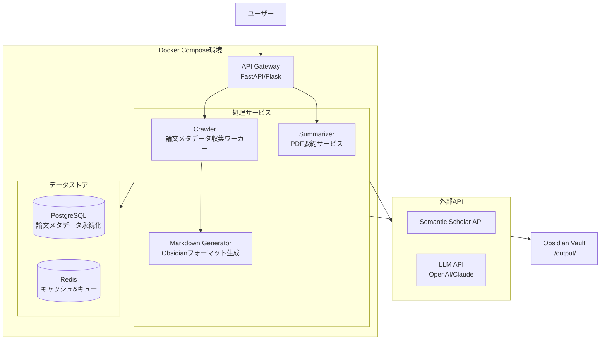
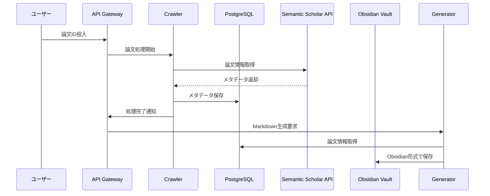
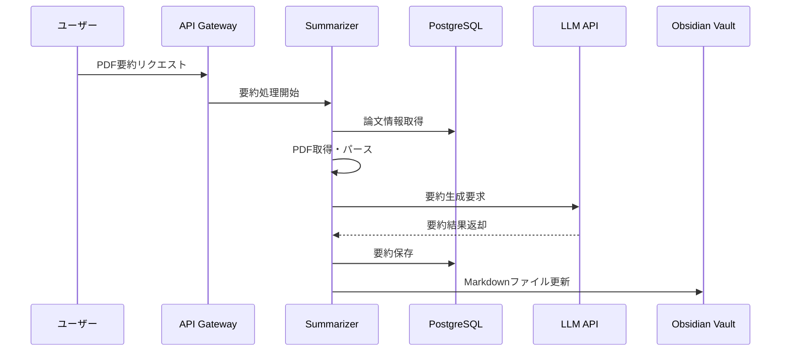
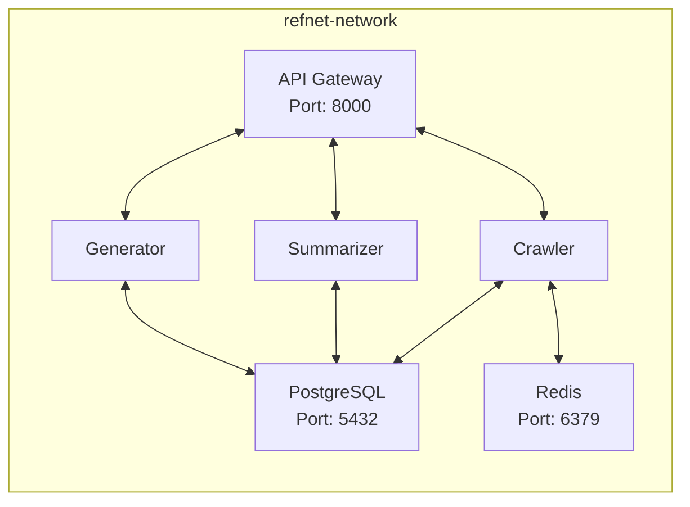
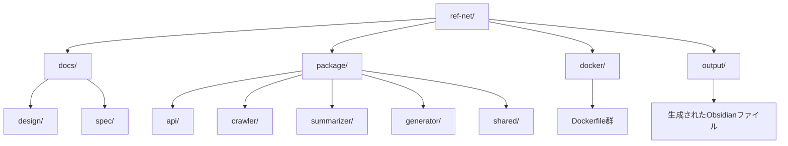

# アーキテクチャ図

本文書は、RAG論文関係性可視化システムのアーキテクチャ図をMermaid記法で表現したものです。

## Docker Composeコンテナ構成

```mermaid
graph TB
    %% ユーザー
    User[ユーザー]

    %% 外部API
    subgraph "外部API"
        SemanticAPI[Semantic Scholar API]
        LLMAPI[LLM API<br/>OpenAI/Claude]
    end

    %% Docker Compose環境
    subgraph "Docker Compose環境"
        %% API Gateway
        API[API Gateway<br/>FastAPI/Flask]

        %% 処理サービス
        subgraph "処理サービス"
            Crawler[Crawler<br/>論文メタデータ収集ワーカー]
            Summarizer[Summarizer<br/>PDF要約サービス]
            Generator[Markdown Generator<br/>Obsidianフォーマット生成]
        end

        %% データストア
        subgraph "データストア"
            PostgreSQL[(PostgreSQL<br/>論文メタデータ永続化)]
            Redis[(Redis<br/>キャッシュ&キュー)]
        end
    end

    %% 出力
    Obsidian[Obsidian Vault<br/>./output/]

    %% 依存関係
    User --> API
    API --> Crawler
    API --> Summarizer
    Crawler --> Generator
    処理サービス --> データストア
    処理サービス --> 外部API
    処理サービス --> Obsidian
```

## データフロー詳細

### 論文メタデータ収集フロー

```mermaid
sequenceDiagram
    participant User as ユーザー
    participant API as API Gateway
    participant Crawler as Crawler
    participant DB as PostgreSQL
    participant SA as Semantic Scholar API
    participant OV as Obsidian Vault

    User->>API: 論文ID投入
    API->>Crawler: 論文処理開始
    Crawler->>SA: 論文情報取得
    SA-->>Crawler: メタデータ返却
    Crawler->>DB: メタデータ保存
    Crawler->>API: 処理完了通知
    API->>Generator: Markdown生成要求
    Generator->>DB: 論文情報取得
    Generator->>OV: Obsidian形式で保存
```

### PDF要約フロー

```mermaid
sequenceDiagram
    participant User as ユーザー
    participant API as API Gateway
    participant Summarizer as Summarizer
    participant DB as PostgreSQL
    participant LLM as LLM API
    participant OV as Obsidian Vault

    User->>API: PDF要約リクエスト
    API->>Summarizer: 要約処理開始
    Summarizer->>DB: 論文情報取得
    Summarizer->>Summarizer: PDF取得・パース
    Summarizer->>LLM: 要約生成要求
    LLM-->>Summarizer: 要約結果返却
    Summarizer->>DB: 要約保存
    Summarizer->>OV: Markdownファイル更新
```

## コンテナ間通信

```mermaid
graph LR
    subgraph "refnet-network"
        API[API Gateway<br/>Port: 8000]
        Crawler[Crawler]
        Summarizer[Summarizer]
        Generator[Generator]
        PostgreSQL[PostgreSQL<br/>Port: 5432]
        Redis[Redis<br/>Port: 6379]
    end

    API <--> Crawler
    API <--> Summarizer
    API <--> Generator

    Crawler <--> PostgreSQL
    Crawler <--> Redis
    Summarizer <--> PostgreSQL
    Generator <--> PostgreSQL
```

## モノレポ構成

```mermaid
graph TD
    Root[ref-net/]

    Root --> Docs[docs/]
    Root --> Package[package/]
    Root --> Docker[docker/]
    Root --> Output[output/]

    Docs --> Design[design/]
    Docs --> Spec[spec/]

    Package --> API[api/]
    Package --> Crawler[crawler/]
    Package --> Summarizer[summarizer/]
    Package --> Generator[generator/]
    Package --> Shared[shared/]

    Docker --> DockerFiles[Dockerfile群]
    Output --> ObsidianFiles[生成されたObsidianファイル]
```
