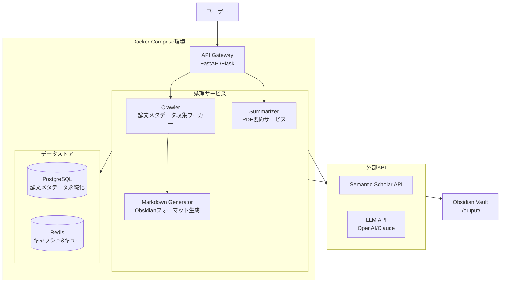
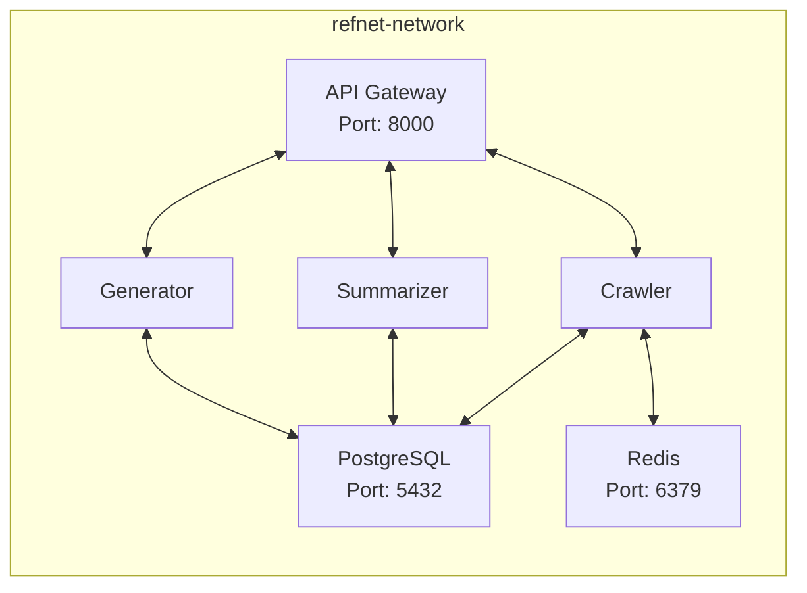
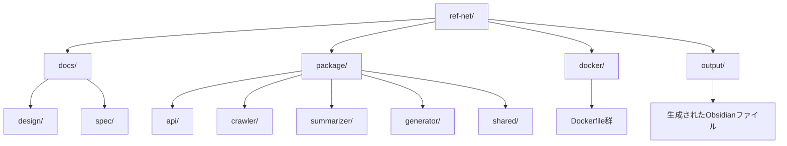

# アーキテクチャ図

本文書は、RAG論文関係性可視化システムのアーキテクチャ図をMermaid記法で表現したものです。

## Docker Composeコンテナ構成

```mermaid
graph TB
    %% ユーザー
    User[ユーザー]

    %% 外部API
    subgraph "外部API"
        SemanticAPI[Semantic Scholar API]
        LLMAPI[LLM API<br/>OpenAI/Claude]
    end

    %% Docker Compose環境
    subgraph "Docker Compose環境"
        %% API Gateway
        API[API Gateway<br/>FastAPI/Flask]

        %% 処理サービス
        subgraph "処理サービス"
            Crawler[Crawler<br/>論文メタデータ収集ワーカー]
            Summarizer[Summarizer<br/>PDF要約サービス]
            Generator[Markdown Generator<br/>Obsidianフォーマット生成]
        end

        %% データストア
        subgraph "データストア"
            PostgreSQL[(PostgreSQL<br/>論文メタデータ永続化)]
            Redis[(Redis<br/>キャッシュ&キュー)]
        end
    end

    %% 出力
    Obsidian[Obsidian Vault<br/>./output/]

    %% 依存関係
    User --> API
    API --> Crawler
    API --> Summarizer
    Crawler --> Generator
    処理サービス --> データストア
    処理サービス --> 外部API
    処理サービス --> Obsidian
```

## データフロー概要

データフローの詳細なシーケンス図は [sequence.md](./sequence.md) を参照してください。

## コンテナ間通信

```mermaid
graph LR
    subgraph "refnet-network"
        API[API Gateway<br/>Port: 8000]
        Crawler[Crawler]
        Summarizer[Summarizer]
        Generator[Generator]
        PostgreSQL[PostgreSQL<br/>Port: 5432]
        Redis[Redis<br/>Port: 6379]
    end

    API <--> Crawler
    API <--> Summarizer
    API <--> Generator

    Crawler <--> PostgreSQL
    Crawler <--> Redis
    Summarizer <--> PostgreSQL
    Generator <--> PostgreSQL
```

## モノレポ構成

```mermaid
graph TD
    Root[ref-net/]

    Root --> Docs[docs/]
    Root --> Package[package/]
    Root --> Docker[docker/]
    Root --> Output[output/]

    Docs --> Design[design/]
    Docs --> Spec[spec/]

    Package --> API[api/]
    Package --> Crawler[crawler/]
    Package --> Summarizer[summarizer/]
    Package --> Generator[generator/]
    Package --> Shared[shared/]

    Docker --> DockerFiles[Dockerfile群]
    Output --> ObsidianFiles[生成されたObsidianファイル]
```
