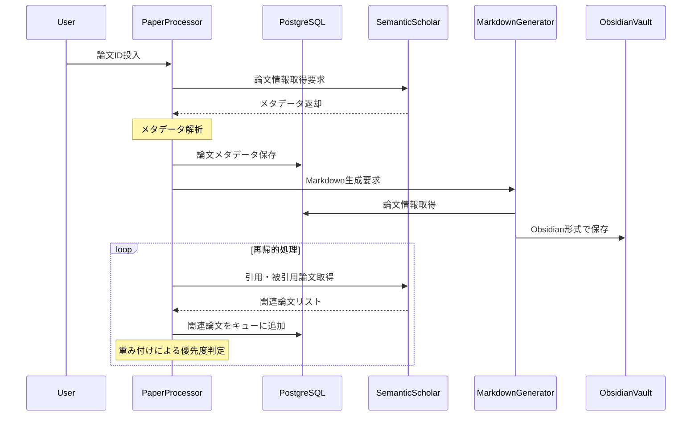
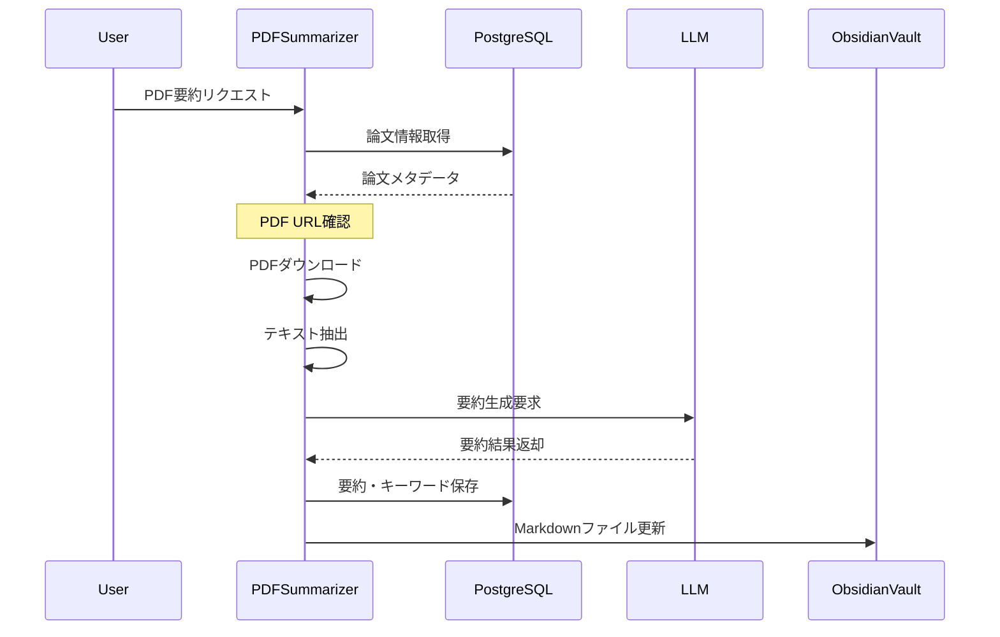
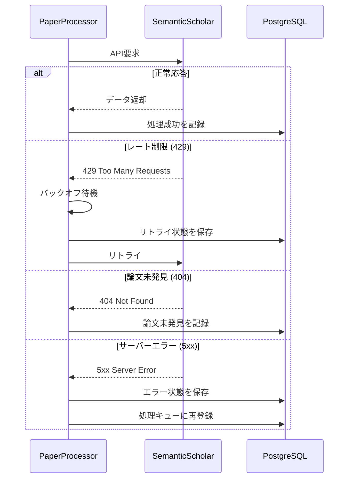
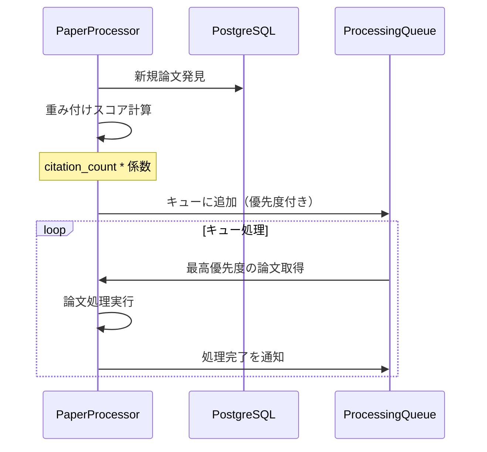

# シーケンス図

本文書は、RAG論文関係性可視化システムの処理フローをシーケンス図で表現したものです。

## 論文メタデータ収集フロー

論文IDを起点として、引用・被引用関係を再帰的に収集する処理フローです。

## PDF要約フロー

独立したサイクルで動作するPDF要約処理フローです。

## エラー処理フロー

API制限やネットワークエラーに対する処理フローです。

## 処理優先度管理フロー

引用数による重み付けと処理優先度の管理フローです。

