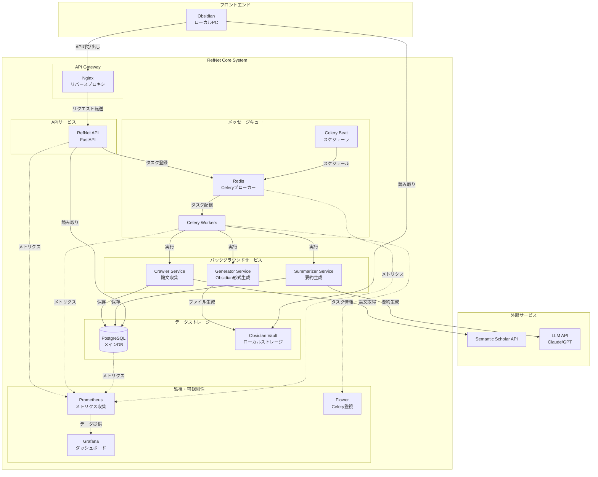
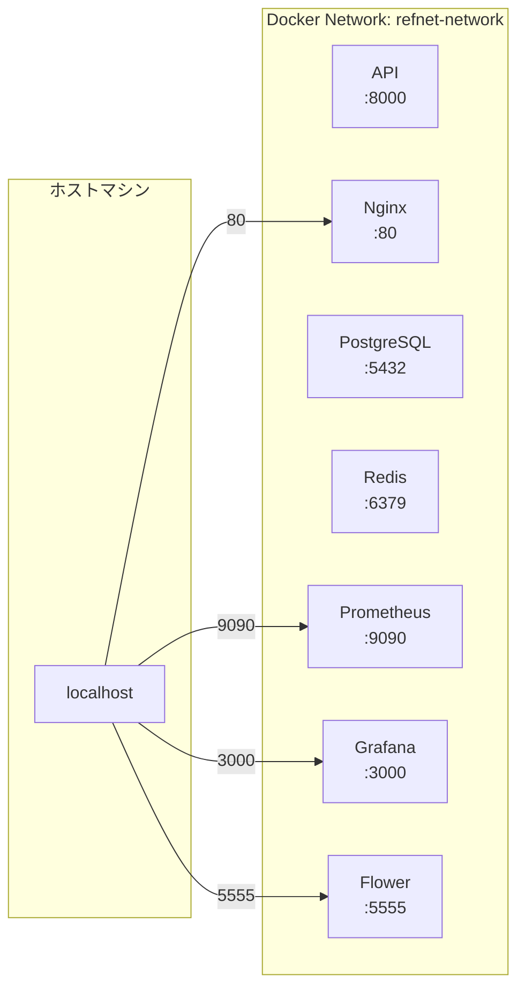

# システムアーキテクチャ図

## 概要

RefNetは、学術論文の参照関係を分析・可視化するシステムです。本ドキュメントでは、システム全体のアーキテクチャとコンポーネント間の関係を説明します。

## システム全体図



## コンポーネント詳細

### 1. フロントエンド層

#### Obsidian
- **役割**: 論文ネットワークの可視化
- **実行環境**: ローカルPC
- **通信**: RefNet APIと連携してデータ取得

### 2. API Gateway層

#### Nginx
- **役割**: リバースプロキシ、負荷分散
- **ポート**: 80 (HTTP), 443 (HTTPS)
- **機能**:
  - リクエストルーティング
  - SSL/TLS終端
  - 静的コンテンツ配信

### 3. アプリケーション層

#### RefNet API
- **フレームワーク**: FastAPI
- **ポート**: 8000
- **主要エンドポイント**:
  - `/papers`: 論文情報の取得・更新
  - `/jobs`: ジョブの作成・管理
  - `/metrics`: Prometheusメトリクス

### 4. バックグラウンドサービス層

#### Crawler Service
- **機能**: Semantic Scholar APIから論文情報を収集
- **トリガー**: APIリクエストまたはスケジュール実行

#### Summarizer Service
- **機能**: LLM APIを使用して論文要約を生成
- **LLM**: Claude 3.5 Sonnet / GPT-4

#### Generator Service
- **機能**: Obsidian用のMarkdownファイル生成
- **出力**: 構造化されたノートファイル

### 5. メッセージキュー層

#### Redis
- **役割**: Celeryのメッセージブローカー
- **ポート**: 6379
- **永続化**: AOF (Append Only File)

#### Celery Workers
- **並列度**: 4ワーカープロセス
- **キュー**: default, crawler, summarizer, generator

#### Celery Beat
- **役割**: 定期タスクのスケジューリング
- **スケジュール**:
  - 論文更新チェック: 毎日午前2時
  - メトリクス集計: 1時間ごと

### 6. データストレージ層

#### PostgreSQL
- **バージョン**: 15
- **ポート**: 5432
- **主要テーブル**:
  - papers: 論文メタデータ
  - citations: 引用関係
  - summaries: 要約データ
  - jobs: ジョブ管理

#### ローカルストレージ
- **用途**: Obsidian Vaultファイル
- **形式**: Markdown (.md)
- **構造**: 年/月/論文ID.md

### 7. 監視・可観測性層

#### Prometheus
- **ポート**: 9090
- **スクレイプ間隔**: 15秒
- **データ保持期間**: 15日

#### Grafana
- **ポート**: 3000
- **ダッシュボード**:
  - システム全体監視
  - Celeryタスク監視
  - データベース性能

#### Flower
- **ポート**: 5555
- **機能**: Celeryタスクのリアルタイム監視

## ネットワーク構成



## セキュリティ考慮事項

1. **ネットワーク分離**: すべてのサービスは専用Dockerネットワーク内で通信
2. **認証**: API認証にJWT使用（将来実装）
3. **シークレット管理**: 環境変数による管理
4. **監査ログ**: すべてのAPIアクセスをログ記録

## スケーラビリティ

1. **水平スケーリング**: Celeryワーカーの追加が容易
2. **キャッシュ**: Redis によるクエリキャッシュ（将来実装）
3. **非同期処理**: 重い処理はすべてCeleryタスク化

## デプロイメント

すべてのサービスはDocker Composeで管理され、単一のコマンドで起動可能：

```bash
docker-compose up -d
```

詳細な起動手順は[運用手順書](../operations/startup-shutdown.md)を参照してください。
