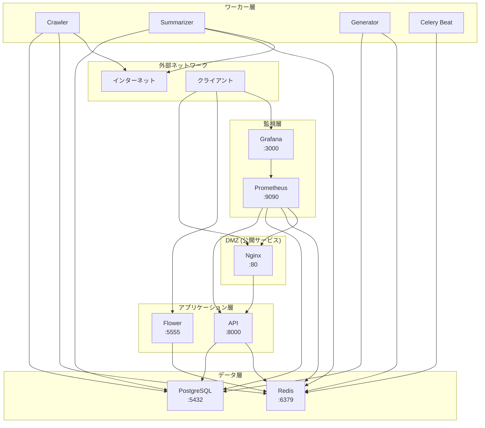

# ネットワークトポロジー

## 概要

RefNetシステムのネットワーク構成とセキュリティ設定を定義します。

## Docker ネットワーク構成

### ネットワーク定義

```yaml
networks:
  refnet-network:
    driver: bridge
    ipam:
      config:
        - subnet: 172.20.0.0/16
```

### サービス別IPアドレス割り当て

| サービス | 内部IP | ホスト名 | 役割 |
|---------|--------|----------|------|
| nginx | 172.20.0.10 | nginx | リバースプロキシ |
| api | 172.20.0.20 | api | APIサーバー |
| postgres | 172.20.0.30 | postgres | データベース |
| redis | 172.20.0.40 | redis | キャッシュ/キュー |
| crawler | 172.20.0.50 | crawler | クローラーワーカー |
| summarizer | 172.20.0.51 | summarizer | 要約ワーカー |
| generator | 172.20.0.52 | generator | 生成ワーカー |
| celery-beat | 172.20.0.60 | celery-beat | スケジューラー |
| flower | 172.20.0.70 | flower | Celery監視 |
| prometheus | 172.20.0.80 | prometheus | メトリクス収集 |
| grafana | 172.20.0.90 | grafana | 可視化 |

## ネットワークセグメンテーション



## ファイアウォールルール

### インバウンドルール

| ソース | デスティネーション | ポート | プロトコル | 説明 |
|--------|------------------|--------|-----------|------|
| 0.0.0.0/0 | nginx | 80 | TCP | HTTP |
| 0.0.0.0/0 | grafana | 3000 | TCP | Grafana UI |
| 0.0.0.0/0 | flower | 5555 | TCP | Flower UI |
| 0.0.0.0/0 | prometheus | 9090 | TCP | Prometheus UI |
| refnet-network | * | * | * | 内部通信許可 |

### アウトバウンドルール

| ソース | デスティネーション | ポート | プロトコル | 説明 |
|--------|------------------|--------|-----------|------|
| crawler | api.semanticscholar.org | 443 | TCP | 論文API |
| summarizer | api.anthropic.com | 443 | TCP | Claude API |
| summarizer | api.openai.com | 443 | TCP | OpenAI API |
| * | * | 53 | UDP | DNS |

## サービス間通信マトリクス

| From \ To | nginx | api | postgres | redis | prometheus | grafana |
|-----------|-------|-----|----------|-------|------------|---------|
| nginx | - | ✓ | - | - | - | - |
| api | - | - | ✓ | ✓ | - | - |
| crawler | - | ✓ | ✓ | ✓ | - | - |
| summarizer | - | ✓ | ✓ | ✓ | - | - |
| generator | - | ✓ | ✓ | ✓ | - | - |
| celery-beat | - | - | - | ✓ | - | - |
| flower | - | - | - | ✓ | - | - |
| prometheus | ✓ | ✓ | ✓ | ✓ | - | - |
| grafana | - | - | - | - | ✓ | - |

## DNS設定

### 内部DNS解決

Dockerの内部DNSにより、サービス名で相互に解決可能：

- `api` → 172.20.0.20
- `postgres` → 172.20.0.30
- `redis` → 172.20.0.40

### 外部DNS

外部APIアクセス用のDNS設定：

```yaml
dns:
  - 8.8.8.8
  - 8.8.4.4
```

## セキュリティ設定

### ネットワーク分離

1. **デフォルトブリッジ無効化**
   ```yaml
   services:
     api:
       networks:
         - refnet-network
       # デフォルトネットワークは使用しない
   ```

2. **内部専用サービス**
   - PostgreSQL: 外部公開なし
   - Redis: 外部公開なし
   - APIサービス: Nginx経由のみアクセス可能

### 通信の暗号化

1. **内部通信**
   - 現在: 平文通信（Docker内部ネットワーク）
   - 将来: TLS対応検討

2. **外部通信**
   - Semantic Scholar API: HTTPS
   - LLM API: HTTPS

## トラブルシューティング

### ネットワーク接続確認

```bash
# コンテナ間の疎通確認
docker exec api ping postgres

# DNS解決確認
docker exec api nslookup postgres

# ポート接続確認
docker exec api nc -zv postgres 5432
```

### ネットワーク診断

```bash
# ネットワーク一覧
docker network ls

# ネットワーク詳細
docker network inspect refnet-network

# コンテナのネットワーク設定
docker inspect api | jq '.[0].NetworkSettings'
```

## ネットワーク最適化

### MTU設定

```yaml
networks:
  refnet-network:
    driver_opts:
      com.docker.network.driver.mtu: 1450
```

### 接続プーリング

- PostgreSQL: 最大接続数100
- Redis: 最大接続数1000
- API → DB: コネクションプール使用
