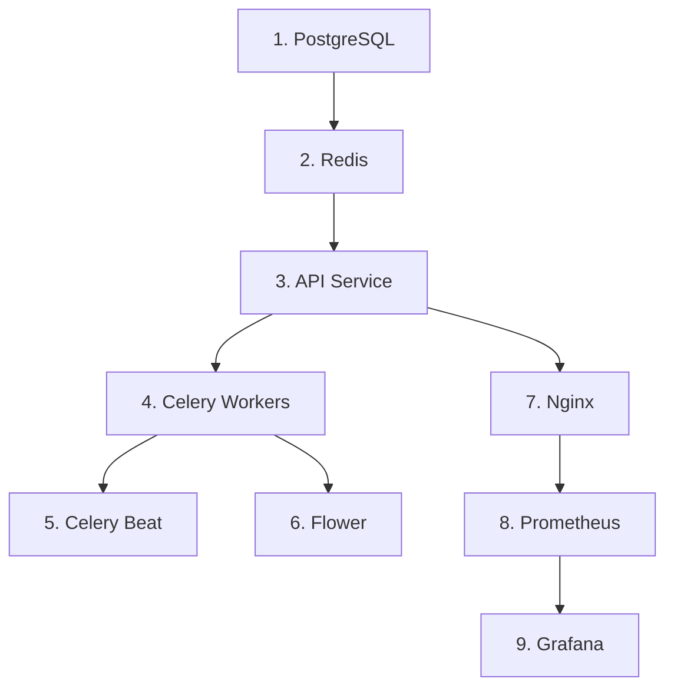

# サービス間依存関係

## 概要

RefNetシステムの各サービス間の依存関係と起動順序を定義します。

## 依存関係マトリクス

| サービス | 依存先 | 依存タイプ | 備考 |
|---------|--------|-----------|------|
| nginx | api | 実行時 | APIへのプロキシ |
| api | postgres, redis | 起動時 | DB接続とキャッシュ |
| crawler | postgres, redis, api | 起動時 | データ保存とタスク管理 |
| summarizer | postgres, redis, api | 起動時 | データ保存とタスク管理 |
| generator | postgres, redis, api | 起動時 | データ読み取りとタスク管理 |
| celery-beat | redis | 起動時 | スケジュール管理 |
| flower | redis, celery | 実行時 | タスク監視 |
| prometheus | all services | 実行時 | メトリクス収集 |
| grafana | prometheus | 起動時 | データソース |

## 起動順序



### 詳細な起動順序

1. **データストア層**
   - PostgreSQL: メインデータベース
   - Redis: メッセージブローカー

2. **アプリケーション層**
   - API Service: コアAPIサービス
   - Celery Workers: バックグラウンドタスク処理

3. **スケジューリング層**
   - Celery Beat: 定期タスクスケジューラ

4. **プロキシ・監視層**
   - Nginx: リバースプロキシ
   - Flower: Celery監視
   - Prometheus: メトリクス収集
   - Grafana: 可視化

## Docker Compose での依存関係定義

```yaml
services:
  api:
    depends_on:
      postgres:
        condition: service_healthy
      redis:
        condition: service_healthy

  crawler:
    depends_on:
      api:
        condition: service_healthy
      redis:
        condition: service_healthy

  nginx:
    depends_on:
      api:
        condition: service_healthy

  prometheus:
    depends_on:
      - api
      - postgres
      - redis
      - nginx
```

## ヘルスチェック設定

### PostgreSQL
```yaml
healthcheck:
  test: ["CMD-SHELL", "pg_isready -U refnet"]
  interval: 10s
  timeout: 5s
  retries: 5
```

### Redis
```yaml
healthcheck:
  test: ["CMD", "redis-cli", "ping"]
  interval: 10s
  timeout: 5s
  retries: 5
```

### API Service
```yaml
healthcheck:
  test: ["CMD", "curl", "-f", "http://localhost:8000/health"]
  interval: 30s
  timeout: 10s
  retries: 3
```

## 障害時の影響範囲

### PostgreSQL障害
- 影響を受けるサービス: API, Crawler, Summarizer, Generator
- 症状: データの読み書き不可、新規タスク実行不可
- 対処: PostgreSQLの再起動、データ復旧

### Redis障害
- 影響を受けるサービス: API, すべてのCeleryワーカー, Celery Beat
- 症状: 新規タスク登録不可、スケジュール実行停止
- 対処: Redisの再起動、キューの再構築

### API Service障害
- 影響を受けるサービス: Nginx（502エラー）、すべてのワーカー
- 症状: Web APIアクセス不可、新規ジョブ作成不可
- 対処: APIサービスの再起動

## サービス間通信

### 同期通信
- Nginx → API: HTTP/REST
- API → PostgreSQL: PostgreSQLプロトコル
- API → Redis: Redisプロトコル

### 非同期通信
- API → Celery: Redisキュー経由
- Celery Beat → Workers: Redisキュー経由
- Workers → External APIs: HTTPS

## ポート一覧

| サービス | 内部ポート | 外部公開ポート |
|---------|-----------|---------------|
| nginx | 80 | 80 |
| api | 8000 | - |
| postgres | 5432 | - |
| redis | 6379 | - |
| flower | 5555 | 5555 |
| prometheus | 9090 | 9090 |
| grafana | 3000 | 3000 |

## サービス再起動時の注意事項

1. **PostgreSQL再起動**
   - すべての依存サービスが一時的に接続エラーとなる
   - 自動再接続により復旧

2. **Redis再起動**
   - 実行中のCeleryタスクが失われる可能性
   - Celery Beat のスケジュールがリセットされる

3. **API再起動**
   - 実行中のHTTPリクエストが失敗
   - Nginxが502エラーを返す

4. **Celeryワーカー再起動**
   - 実行中のタスクは再実行される（タスクがべき等である前提）
