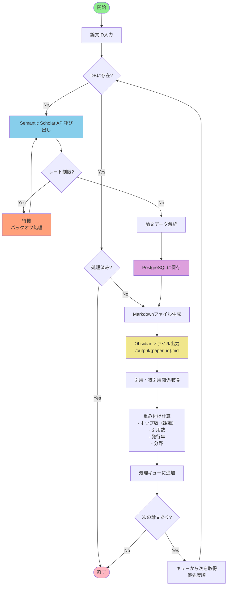
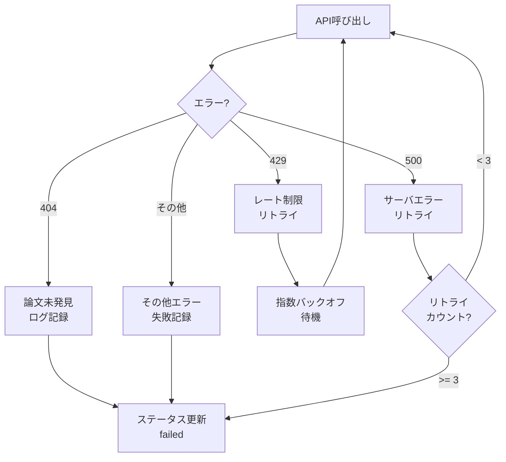
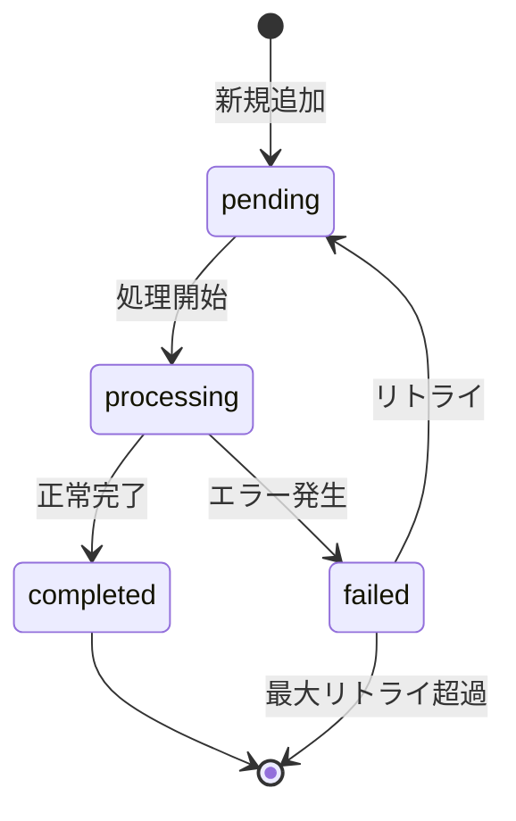
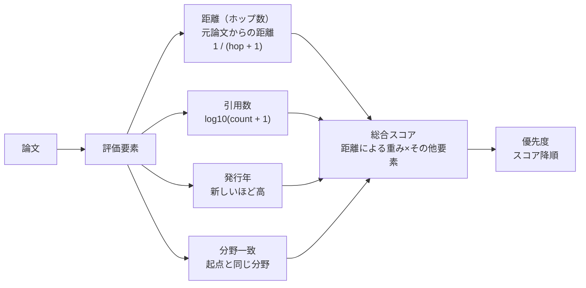

# Paper Processor フローチャート

## 概要

Paper Processorは、Semantic Scholar APIを使用して論文情報を取得し、引用・被引用関係を再帰的に収集するサービスです。

## フローチャート

## エラーハンドリング

## 処理ステータス管理

## 重み付けアルゴリズム

### 距離（ホップ数）による優先度

- **ホップ数0（元論文）**: 重み = 1.0
- **ホップ数1（直接の引用・被引用）**: 重み = 0.5
- **ホップ数2（引用の引用）**: 重み = 0.33
- **ホップ数3以降**: 重み = 1 / (hop + 1)

この方式により、元論文に近い論文ほど高い優先度で処理され、離れるほど優先度が下がります。