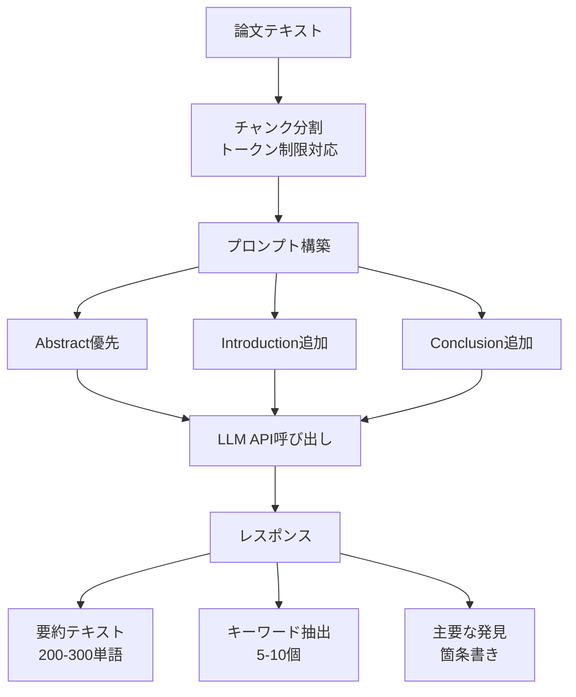
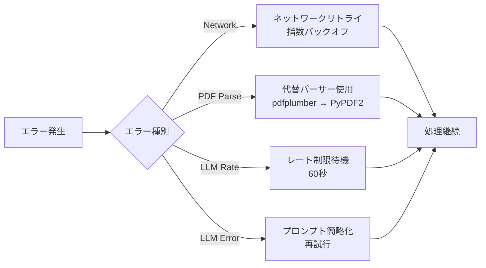
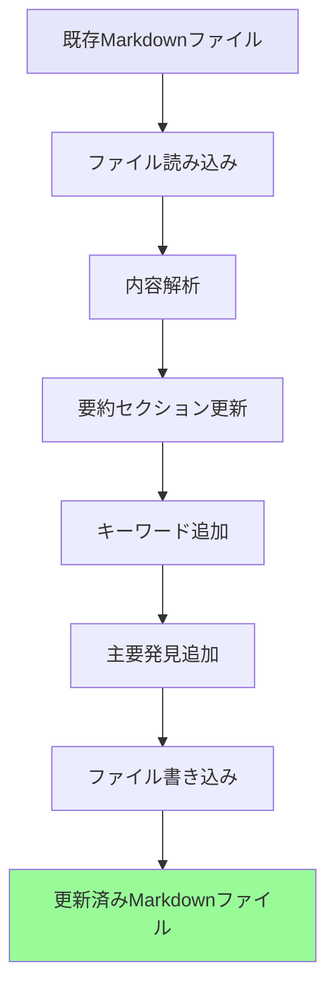

# PDF Summarizer フローチャート

## 概要

PDF Summarizerは、論文のPDFをダウンロードしてLLM APIを使用して要約を生成するサービスです。Paper Processorとは独立して動作します。

## フローチャート

```mermaid
flowchart TD
    Start([開始]) --> InputID[論文ID入力]
    InputID --> CheckDBExists{DBに論文存在?}
    
    CheckDBExists -->|No| ErrorNoData[エラー: 論文データなし]
    CheckDBExists -->|Yes| CheckSummary{要約済み?}
    
    ErrorNoData --> End([終了])
    CheckSummary -->|Yes| End
    CheckSummary -->|No| GetPDFUrl[DBからPDF URL取得]
    
    GetPDFUrl --> CheckURL{PDF URLあり?}
    CheckURL -->|No| SearchOpenAccess[OpenAccessPDF検索]
    CheckURL -->|Yes| DownloadPDF[PDFダウンロード]
    
    SearchOpenAccess --> FoundURL{URL発見?}
    FoundURL -->|No| ErrorNoPDF[エラー: PDF未発見]
    FoundURL -->|Yes| DownloadPDF
    
    ErrorNoPDF --> End
    
    DownloadPDF --> CheckDownload{ダウンロード成功?}
    CheckDownload -->|No| RetryDownload{リトライ?}
    CheckDownload -->|Yes| ExtractText[テキスト抽出<br/>PyPDF2/pdfplumber]
    
    RetryDownload -->|Yes<br/>< 3回| DownloadPDF
    RetryDownload -->|No<br/>>= 3回| ErrorDownload[エラー: ダウンロード失敗]
    ErrorDownload --> End
    
    ExtractText --> CheckText{テキスト抽出成功?}
    CheckText -->|No| ErrorExtract[エラー: 抽出失敗]
    CheckText -->|Yes| PreparePrompt[プロンプト準備]
    
    ErrorExtract --> End
    
    PreparePrompt --> CallLLM[LLM API呼び出し<br/>OpenAI/Claude]
    
    CallLLM --> CheckLLM{API成功?}
    CheckLLM -->|No| RetryLLM{リトライ?}
    CheckLLM -->|Yes| ParseResult[結果解析<br/>- 要約<br/>- キーワード]
    
    RetryLLM -->|Yes<br/>< 3回| CallLLM
    RetryLLM -->|No<br/>>= 3回| ErrorLLM[エラー: LLM失敗]
    ErrorLLM --> End
    
    ParseResult --> SaveDB[PostgreSQL更新<br/>summary, keywords]
    SaveDB --> UpdateMD[Markdownファイル更新<br/>/output/{paper_id}.md]
    UpdateMD --> End
    
    style Start fill:#90EE90
    style End fill:#FFB6C1
    style CallLLM fill:#87CEEB
    style SaveDB fill:#DDA0DD
    style UpdateMD fill:#F0E68C
```

## LLM処理詳細



## エラーハンドリング戦略



## ファイル更新フロー

