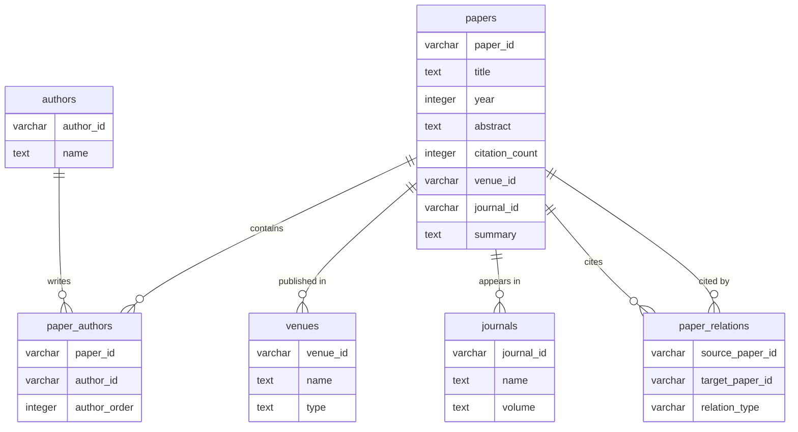
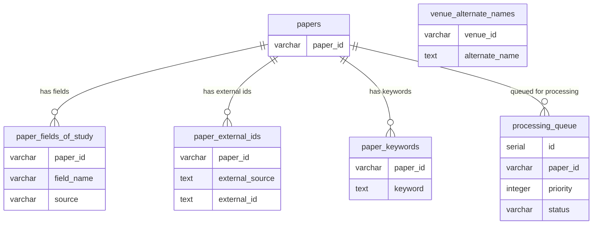

# PostgreSQLテーブル定義書

## 1. ER図

### 1.1 メインエンティティ関係図



### 1.2 詳細属性テーブル



## 2. テーブル詳細仕様

### 2.1 papers テーブル

論文のメタデータを管理するマスターテーブル。

| カラム名 | データ型 | NULL許可 | デフォルト値 | 説明 |
|---------|---------|----------|-------------|------|
| paper_id | VARCHAR(100) | NO | - | 論文の一意識別子（Primary Key）。Semantic ScholarのpaperId |
| title | TEXT | YES | NULL | 論文タイトル |
| year | INTEGER | YES | NULL | 出版年 |
| abstract | TEXT | YES | NULL | 論文要約 |
| citation_count | INTEGER | YES | 0 | 被引用数 |
| influential_citation_count | INTEGER | YES | 0 | 影響力のある引用数 |
| reference_count | INTEGER | YES | 0 | 参照論文数 |
| venue | TEXT | YES | NULL | 出版会場名（非正規化、検索用） |
| venue_id | VARCHAR(100) | YES | NULL | 出版会場ID（Foreign Key → venues.venue_id） |
| publication_date | DATE | YES | NULL | 出版日（YYYY-MM-DD形式） |
| journal_id | VARCHAR(100) | YES | NULL | ジャーナルID（Foreign Key → journals.journal_id） |
| corpus_id | TEXT | YES | NULL | Semantic ScholarのcorpusId |
| is_open_access | BOOLEAN | YES | FALSE | オープンアクセスかどうか |
| open_access_pdf_url | TEXT | YES | NULL | オープンアクセスPDFのURL |
| open_access_pdf_status | TEXT | YES | NULL | オープンアクセスのステータス（HYBRID, GOLD等） |
| open_access_pdf_license | TEXT | YES | NULL | オープンアクセスのライセンス（CCBY等） |
| pdf_url | TEXT | YES | NULL | PDFのURL（オープンアクセスまたは取得可能な場合） |
| summary | TEXT | YES | NULL | AI生成要約（PDF Summarizerで生成） |
| processed_at | TIMESTAMP | YES | NULL | メタデータ処理完了日時 |
| created_at | TIMESTAMP | NO | CURRENT_TIMESTAMP | レコード作成日時 |
| updated_at | TIMESTAMP | NO | CURRENT_TIMESTAMP | レコード更新日時 |

**制約:**
- PRIMARY KEY: `paper_id`
- FOREIGN KEY: `venue_id` REFERENCES venues(venue_id)
- FOREIGN KEY: `journal_id` REFERENCES journals(journal_id)

**インデックス:**
- PRIMARY KEY: `paper_id`
- INDEX: `idx_papers_year` (year)
- INDEX: `idx_papers_citation` (citation_count DESC)
- INDEX: `idx_papers_corpus_id` (corpus_id)
- INDEX: `idx_papers_venue_id` (venue_id)
- INDEX: `idx_papers_journal_id` (journal_id)

### 2.2 paper_authors テーブル

論文と著者の多対多関係を管理するテーブル。

| カラム名 | データ型 | NULL許可 | デフォルト値 | 説明 |
|---------|---------|----------|-------------|------|
| paper_id | VARCHAR(100) | NO | - | 論文ID（Foreign Key → papers.paper_id） |
| author_id | VARCHAR(100) | NO | - | 著者ID（Foreign Key → authors.author_id） |
| author_order | INTEGER | NO | - | 著者の順序（第一著者=1、第二著者=2...） |
| created_at | TIMESTAMP | NO | CURRENT_TIMESTAMP | レコード作成日時 |

**制約:**
- PRIMARY KEY: `(paper_id, author_id)`
- FOREIGN KEY: `paper_id` REFERENCES papers(paper_id) ON DELETE CASCADE
- FOREIGN KEY: `author_id` REFERENCES authors(author_id) ON DELETE CASCADE
- CHECK: `author_order > 0`

**インデックス:**
- PRIMARY KEY: 複合キー
- INDEX: `idx_paper_authors_order` (paper_id, author_order)
- INDEX: `idx_paper_authors_author_id` (author_id)

### 2.3 authors テーブル

著者情報を管理するマスターテーブル。

| カラム名 | データ型 | NULL許可 | デフォルト値 | 説明 |
|---------|---------|----------|-------------|------|
| author_id | VARCHAR(100) | NO | - | 著者の一意識別子（Primary Key）。Semantic ScholarのauthorId |
| name | TEXT | NO | - | 著者名 |
| created_at | TIMESTAMP | NO | CURRENT_TIMESTAMP | レコード作成日時 |
| updated_at | TIMESTAMP | NO | CURRENT_TIMESTAMP | レコード更新日時 |

**制約:**
- PRIMARY KEY: `author_id`
- UNIQUE: `(name)` （同一著者の重複防止）

**インデックス:**
- PRIMARY KEY: `author_id`
- INDEX: `idx_authors_name` (name)

### 2.4 paper_fields_of_study テーブル

論文と研究分野の関連を管理するテーブル。

| カラム名 | データ型 | NULL許可 | デフォルト値 | 説明 |
|---------|---------|----------|-------------|------|
| paper_id | VARCHAR(100) | NO | - | 論文ID（Foreign Key → papers.paper_id） |
| field_name | VARCHAR(100) | NO | - | 研究分野名（Computer Science、Medicine等） |
| source | VARCHAR(20) | NO | - | 分類ソース（external、s2-fos-model） |
| created_at | TIMESTAMP | NO | CURRENT_TIMESTAMP | レコード作成日時 |

**制約:**
- PRIMARY KEY: `(paper_id, field_name, source)`
- FOREIGN KEY: `paper_id` REFERENCES papers(paper_id) ON DELETE CASCADE
- CHECK: `source IN ('external', 's2-fos-model')`

**インデックス:**
- PRIMARY KEY: 複合キー
- INDEX: `idx_paper_fields_field_name` (field_name)
- INDEX: `idx_paper_fields_source` (source)

### 2.5 venues テーブル

出版会場（会議・ジャーナル）情報を管理するテーブル。

| カラム名 | データ型 | NULL許可 | デフォルト値 | 説明 |
|---------|---------|----------|-------------|------|
| venue_id | VARCHAR(100) | NO | - | 会場の一意識別子（Primary Key）。Semantic ScholarのvenueId |
| name | TEXT | NO | - | 会場名 |
| type | VARCHAR(20) | YES | NULL | 会場種別（conference、journal） |
| url | TEXT | YES | NULL | 会場のWebサイトURL |
| created_at | TIMESTAMP | NO | CURRENT_TIMESTAMP | レコード作成日時 |
| updated_at | TIMESTAMP | NO | CURRENT_TIMESTAMP | レコード更新日時 |

**制約:**
- PRIMARY KEY: `venue_id`
- CHECK: `type IN ('conference', 'journal')` OR `type IS NULL`

**インデックス:**
- PRIMARY KEY: `venue_id`
- INDEX: `idx_venues_name` (name)
- INDEX: `idx_venues_type` (type)

### 2.6 venue_alternate_names テーブル

会場の別名を管理するテーブル。

| カラム名 | データ型 | NULL許可 | デフォルト値 | 説明 |
|---------|---------|----------|-------------|------|
| venue_id | VARCHAR(100) | NO | - | 会場ID（Foreign Key → venues.venue_id） |
| alternate_name | TEXT | NO | - | 別名 |
| created_at | TIMESTAMP | NO | CURRENT_TIMESTAMP | レコード作成日時 |

**制約:**
- PRIMARY KEY: `(venue_id, alternate_name)`
- FOREIGN KEY: `venue_id` REFERENCES venues(venue_id) ON DELETE CASCADE

**インデックス:**
- PRIMARY KEY: 複合キー
- INDEX: `idx_venue_alternate_names_name` (alternate_name)

### 2.7 journals テーブル

ジャーナル情報を管理するテーブル。

| カラム名 | データ型 | NULL許可 | デフォルト値 | 説明 |
|---------|---------|----------|-------------|------|
| journal_id | VARCHAR(100) | NO | - | ジャーナルの一意識別子（Primary Key） |
| name | TEXT | NO | - | ジャーナル名 |
| volume | TEXT | YES | NULL | 巻数 |
| pages | TEXT | YES | NULL | ページ範囲 |
| created_at | TIMESTAMP | NO | CURRENT_TIMESTAMP | レコード作成日時 |
| updated_at | TIMESTAMP | NO | CURRENT_TIMESTAMP | レコード更新日時 |

**制約:**
- PRIMARY KEY: `journal_id`

**インデックス:**
- PRIMARY KEY: `journal_id`
- INDEX: `idx_journals_name` (name)

### 2.8 paper_external_ids テーブル

論文の外部識別子を管理するテーブル。

| カラム名 | データ型 | NULL許可 | デフォルト値 | 説明 |
|---------|---------|----------|-------------|------|
| paper_id | VARCHAR(100) | NO | - | 論文ID（Foreign Key → papers.paper_id） |
| external_source | VARCHAR(20) | NO | - | 外部ソース（DOI、ArXiv、MAG、ACL、PubMed、DBLP等） |
| external_id | TEXT | NO | - | 外部識別子 |
| created_at | TIMESTAMP | NO | CURRENT_TIMESTAMP | レコード作成日時 |

**制約:**
- PRIMARY KEY: `(paper_id, external_source)`
- FOREIGN KEY: `paper_id` REFERENCES papers(paper_id) ON DELETE CASCADE
- CHECK: `external_source IN ('DOI', 'ArXiv', 'MAG', 'ACL', 'PubMed', 'DBLP', 'Medline', 'PubMedCentral')`

**インデックス:**
- PRIMARY KEY: 複合キー
- INDEX: `idx_paper_external_ids_source` (external_source)
- INDEX: `idx_paper_external_ids_external_id` (external_id)

### 2.9 paper_keywords テーブル

AI生成キーワードを管理するテーブル。

| カラム名 | データ型 | NULL許可 | デフォルト値 | 説明 |
|---------|---------|----------|-------------|------|
| paper_id | VARCHAR(100) | NO | - | 論文ID（Foreign Key → papers.paper_id） |
| keyword | TEXT | NO | - | キーワード |
| created_at | TIMESTAMP | NO | CURRENT_TIMESTAMP | レコード作成日時 |

**制約:**
- PRIMARY KEY: `(paper_id, keyword)`
- FOREIGN KEY: `paper_id` REFERENCES papers(paper_id) ON DELETE CASCADE

**インデックス:**
- PRIMARY KEY: 複合キー
- INDEX: `idx_paper_keywords_keyword` (keyword)

### 2.10 paper_relations テーブル

論文間の引用・被引用関係を管理する関連テーブル。

| カラム名 | データ型 | NULL許可 | デフォルト値 | 説明 |
|---------|---------|----------|-------------|------|
| source_paper_id | VARCHAR(100) | NO | - | 元論文ID（Foreign Key → papers.paper_id） |
| target_paper_id | VARCHAR(100) | NO | - | 対象論文ID（Foreign Key → papers.paper_id） |
| relation_type | VARCHAR(20) | NO | - | 関係種別。'cites'（引用）または 'cited_by'（被引用） |
| created_at | TIMESTAMP | NO | CURRENT_TIMESTAMP | レコード作成日時 |

**制約:**
- PRIMARY KEY: `(source_paper_id, target_paper_id, relation_type)`
- FOREIGN KEY: `source_paper_id` REFERENCES papers(paper_id) ON DELETE CASCADE
- FOREIGN KEY: `target_paper_id` REFERENCES papers(paper_id) ON DELETE CASCADE
- CHECK: `relation_type IN ('cites', 'cited_by')`

**インデックス:**
- PRIMARY KEY: 複合キー
- INDEX: `idx_relations_target` (target_paper_id)
- INDEX: `idx_relations_type` (relation_type)

### 2.11 processing_queue テーブル

論文収集処理のキュー管理テーブル。

| カラム名 | データ型 | NULL許可 | デフォルト値 | 説明 |
|---------|---------|----------|-------------|------|
| id | SERIAL | NO | - | キューID（Primary Key） |
| paper_id | VARCHAR(100) | NO | - | 処理対象論文ID |
| priority | INTEGER | NO | 0 | 処理優先度（値が大きいほど優先） |
| status | VARCHAR(20) | NO | 'pending' | 処理状態 |
| retry_count | INTEGER | NO | 0 | リトライ回数 |
| error_message | TEXT | YES | NULL | エラーメッセージ |
| created_at | TIMESTAMP | NO | CURRENT_TIMESTAMP | レコード作成日時 |
| updated_at | TIMESTAMP | NO | CURRENT_TIMESTAMP | レコード更新日時 |

**制約:**
- PRIMARY KEY: `id`
- UNIQUE: `paper_id` （同一論文の重複登録防止）
- CHECK: `status IN ('pending', 'processing', 'completed', 'failed')`
- CHECK: `priority >= 0`
- CHECK: `retry_count >= 0`

**インデックス:**
- PRIMARY KEY: `id`
- INDEX: `idx_queue_status_priority` (status, priority DESC)
- INDEX: `idx_queue_paper_id` (paper_id)

## 3. 正規化設計の利点

### 3.1 JSONBからテーブル分割への変更理由

1. **データ整合性**: 著者情報や会場情報の重複を防ぎ、一意性を保つ
2. **検索性能**: 著者名や研究分野での高速な検索が可能
3. **関連性分析**: 著者間の共著関係や研究分野の分析が容易
4. **スケーラビリティ**: 大量データでのパフォーマンス向上
5. **メンテナンス性**: スキーマ変更時の影響範囲が明確

### 3.2 データ正規化の詳細

**第1正規形 (1NF)**:
- 全てのカラムが原子値（JSONBをテーブルに分割）

**第2正規形 (2NF)**:
- 部分関数従属を除去（著者情報、会場情報を別テーブルへ）

**第3正規形 (3NF)**:
- 推移関数従属を除去（会場別名を別テーブルへ）

## 4. 処理フロー補足

### 4.1 重み付けスコア計算

`processing_queue.priority` の算出ロジック：

```
priority = base_score * recency_factor * citation_factor

where:
  base_score = 100 (起点論文からの距離に応じて減衰)
  recency_factor = 1.0 + (current_year - paper_year) * 0.1
  citation_factor = log10(citation_count + 1)
```

### 4.2 トランザクション設計

正規化されたテーブル構成でのデータ登録手順：

1. **マスターデータ登録**: authors, venues, journals テーブルへの登録
2. **論文メタデータ登録**: papers テーブルへの登録
3. **関連データ登録**: paper_authors, paper_fields_of_study, paper_external_ids, paper_keywords テーブルへの登録
4. **引用関係登録**: paper_relations テーブルへの登録

各ステップは同一トランザクションで実行し、データ一貫性を保つ。

## 5. パフォーマンス考慮事項

### 5.1 インデックス戦略

- **複合インデックス**: 頻繁な検索パターンに対して複合インデックスを作成
- **パーシャルインデックス**: 大量データでは条件付きインデックスを検討

### 5.2 パーティショニング

- **時間6分割**: papers テーブルを出版年でパーティション化を検討
- **関係テーブル**: paper_relations はシャード化で分散処理を検討

### 5.3 メンテナンス

- **統計情報更新**: 全テーブルに対して定期的なANALYZE実行
- **デッドタプル清理**: 高更新頻度テーブルのVACUUMスケジュール設定
- **アーカイブ**: 古い処理キューレコードのアーカイブ化