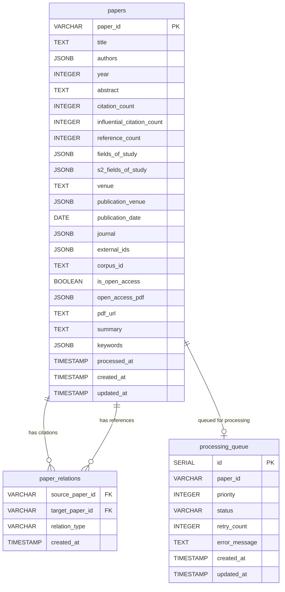

# PostgreSQLテーブル定義書

## 1. ER図



## 2. テーブル詳細仕様

### 2.1 papers テーブル

論文のメタデータを管理するマスターテーブル。

| カラム名 | データ型 | NULL許可 | デフォルト値 | 説明 |
|---------|---------|----------|-------------|------|
| paper_id | VARCHAR(100) | NO | - | 論文の一意識別子（Primary Key）。Semantic ScholarのpaperId |
| title | TEXT | YES | NULL | 論文タイトル |
| authors | JSONB | YES | NULL | 著者情報の配列。各要素は `{authorId, name}` 形式 |
| year | INTEGER | YES | NULL | 出版年 |
| abstract | TEXT | YES | NULL | 論文要約 |
| citation_count | INTEGER | YES | 0 | 被引用数 |
| influential_citation_count | INTEGER | YES | 0 | 影響力のある引用数 |
| reference_count | INTEGER | YES | 0 | 参照論文数 |
| fields_of_study | JSONB | YES | NULL | 研究分野の配列（外部ソース） |
| s2_fields_of_study | JSONB | YES | NULL | Semantic Scholar分類の研究分野。`[{category, source}]` 形式 |
| venue | TEXT | YES | NULL | 出版会場名 |
| publication_venue | JSONB | YES | NULL | 出版会場詳細。`{id, name, type, alternate_names, url}` 形式 |
| publication_date | DATE | YES | NULL | 出版日（YYYY-MM-DD形式） |
| journal | JSONB | YES | NULL | ジャーナル情報。`{name, volume, pages}` 形式 |
| external_ids | JSONB | YES | NULL | 外部ID。`{DOI, ArXiv, MAG, ACL, PubMed, DBLP}` 等 |
| corpus_id | TEXT | YES | NULL | Semantic ScholarのcorpusId |
| is_open_access | BOOLEAN | YES | FALSE | オープンアクセスかどうか |
| open_access_pdf | JSONB | YES | NULL | オープンアクセスPDF情報。`{url, status, license}` 形式 |
| pdf_url | TEXT | YES | NULL | PDFのURL（オープンアクセスまたは取得可能な場合） |
| summary | TEXT | YES | NULL | AI生成要約（PDF Summarizerで生成） |
| keywords | JSONB | YES | NULL | AI抽出キーワード配列（PDF Summarizerで生成） |
| processed_at | TIMESTAMP | YES | NULL | メタデータ処理完了日時 |
| created_at | TIMESTAMP | NO | CURRENT_TIMESTAMP | レコード作成日時 |
| updated_at | TIMESTAMP | NO | CURRENT_TIMESTAMP | レコード更新日時 |

**インデックス:**
- PRIMARY KEY: `paper_id`
- INDEX: `idx_papers_year` (year)
- INDEX: `idx_papers_citation` (citation_count DESC)
- INDEX: `idx_papers_corpus_id` (corpus_id)

### 2.2 paper_relations テーブル

論文間の引用・被引用関係を管理する関連テーブル。

| カラム名 | データ型 | NULL許可 | デフォルト値 | 説明 |
|---------|---------|----------|-------------|------|
| source_paper_id | VARCHAR(100) | NO | - | 元論文ID（Foreign Key → papers.paper_id） |
| target_paper_id | VARCHAR(100) | NO | - | 対象論文ID（Foreign Key → papers.paper_id） |
| relation_type | VARCHAR(20) | NO | - | 関係種別。'cites'（引用）または 'cited_by'（被引用） |
| created_at | TIMESTAMP | NO | CURRENT_TIMESTAMP | レコード作成日時 |

**制約:**
- PRIMARY KEY: `(source_paper_id, target_paper_id, relation_type)`
- FOREIGN KEY: `source_paper_id` REFERENCES papers(paper_id) ON DELETE CASCADE
- FOREIGN KEY: `target_paper_id` REFERENCES papers(paper_id) ON DELETE CASCADE
- CHECK: `relation_type IN ('cites', 'cited_by')`

**インデックス:**
- PRIMARY KEY: 複合キー
- INDEX: `idx_relations_target` (target_paper_id)
- INDEX: `idx_relations_type` (relation_type)

### 2.3 processing_queue テーブル

論文収集処理のキュー管理テーブル。

| カラム名 | データ型 | NULL許可 | デフォルト値 | 説明 |
|---------|---------|----------|-------------|------|
| id | SERIAL | NO | - | キューID（Primary Key） |
| paper_id | VARCHAR(100) | NO | - | 処理対象論文ID |
| priority | INTEGER | NO | 0 | 処理優先度（値が大きいほど優先） |
| status | VARCHAR(20) | NO | 'pending' | 処理状態 |
| retry_count | INTEGER | NO | 0 | リトライ回数 |
| error_message | TEXT | YES | NULL | エラーメッセージ |
| created_at | TIMESTAMP | NO | CURRENT_TIMESTAMP | レコード作成日時 |
| updated_at | TIMESTAMP | NO | CURRENT_TIMESTAMP | レコード更新日時 |

**制約:**
- PRIMARY KEY: `id`
- UNIQUE: `paper_id` （同一論文の重複登録防止）
- CHECK: `status IN ('pending', 'processing', 'completed', 'failed')`
- CHECK: `priority >= 0`
- CHECK: `retry_count >= 0`

**インデックス:**
- PRIMARY KEY: `id`
- INDEX: `idx_queue_status_priority` (status, priority DESC)
- INDEX: `idx_queue_paper_id` (paper_id)

## 3. データ型補足説明

### 3.1 JSONB型のスキーマ

**authors:**
```json
[
  {
    "authorId": "1741101",
    "name": "Oren Etzioni"
  }
]
```

**fields_of_study:**
```json
["Computer Science", "Mathematics"]
```

**s2_fields_of_study:**
```json
[
  {
    "category": "Computer Science",
    "source": "external"
  },
  {
    "category": "Mathematics",
    "source": "s2-fos-model"
  }
]
```

**publication_venue:**
```json
{
  "id": "1e33b3be-b2ab-46e9-96e8-d4eb4bad6e44",
  "name": "Annual Meeting of the Association for Computational Linguistics",
  "type": "conference",
  "alternate_names": ["ACL", "Meet Assoc Comput Linguistics"],
  "url": "https://www.aclweb.org/anthology/venues/acl/"
}
```

**journal:**
```json
{
  "name": "IETE Technical Review",
  "volume": "40",
  "pages": "116 - 135"
}
```

**external_ids:**
```json
{
  "MAG": "3015453090",
  "DBLP": "conf/acl/LoWNKW20",
  "ACL": "2020.acl-main.447",
  "DOI": "10.18653/V1/2020.ACL-MAIN.447",
  "ArXiv": "1805.02262",
  "PubMed": "12345678"
}
```

**open_access_pdf:**
```json
{
  "url": "https://www.aclweb.org/anthology/2020.acl-main.447.pdf",
  "status": "HYBRID",
  "license": "CCBY"
}
```

**keywords:**
```json
["RAG", "論文グラフ", "引用ネットワーク", "Semantic Scholar"]
```

## 4. 処理フロー補足

### 4.1 重み付けスコア計算

`processing_queue.priority` の算出ロジック：

```
priority = base_score * recency_factor * citation_factor

where:
  base_score = 100 (起点論文からの距離に応じて減衰)
  recency_factor = 1.0 + (current_year - paper_year) * 0.1
  citation_factor = log10(citation_count + 1)
```

### 4.2 トランザクション設計

- 論文メタデータ登録時は、`papers` と `paper_relations` を同一トランザクションで更新
- `processing_queue` への登録は別トランザクションで実行（処理失敗時の再登録を考慮）

## 5. パフォーマンス考慮事項

- `authors` や `fields_of_study` などのJSONB型カラムは、GINインデックスの追加を検討
- 大量の引用関係を持つ論文の処理時は、バッチ処理を推奨
- `paper_relations` テーブルは増大しやすいため、定期的なVACUUM ANALYZEを実施