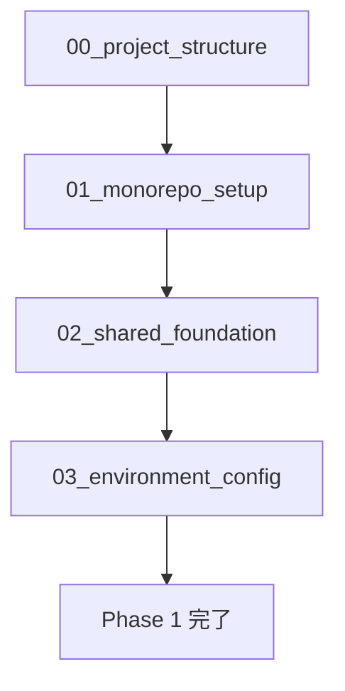

# Phase 1: プロジェクト基盤構築

## 目的

開発環境とプロジェクト構造を確立し、並列開発に必要な基盤を整備する。このフェーズは全ての後続フェーズの前提条件となるため、確実に完了させる必要がある。

## ゴール

- 統一された開発環境の構築
- モノレポ管理システムの導入
- 共通ライブラリの基盤設定
- 環境別設定管理システムの確立
- 品質管理ツールの導入

## フェーズ構成

### 事前準備タスク（00_project_structure.md）
全体のディレクトリ構造とパッケージ初期化を行う必須タスク。

### 順次実行タスク
1. **01_monorepo_setup.md** - Moonrepoによるモノレポ環境構築
2. **02_shared_foundation.md** - 共通ライブラリの基本設定
3. **03_environment_config.md** - 環境設定管理システム

## 実行順序

## 実施者

- **推奨**: 1名のテックリード
- **実施場所**: メインリポジトリ（worktree不要）
- **ブランチ**: `claude/phase1-$(date +'%Y%m%d%H%M%S')`

## 完了条件

### 必須条件
- [ ] 全ディレクトリ構造が作成されている
- [ ] moonrepoが正常に動作する
- [ ] 共通ライブラリがインポート可能
- [ ] 環境別設定が正しく読み込まれる
- [ ] `moon :check` が全パッケージで正常終了
- [ ] 開発規約に準拠したコードが生成されている

### 品質条件
- [ ] 各パッケージのテストカバレッジ80%以上
- [ ] 型チェック（mypy）が通る
- [ ] リントチェック（ruff）が通る
- [ ] セキュリティチェックが通る

### ドキュメント条件
- [ ] 各パッケージにREADME.mdが存在
- [ ] API仕様書が生成されている（該当部分）
- [ ] 設定ファイルにコメントが記載されている

## 必要なスキル・知識

- Python パッケージ管理（uv, pyproject.toml）
- Moonrepo の設定と使用方法
- SQLAlchemy の基本的な使用方法
- Pydantic による設定管理
- 環境変数による設定管理
- Git ブランチ戦略

## 前提条件

- Python 3.12+ がインストール済み
- uv がインストール済み
- Git が設定済み
- VSCode または PyCharm等のIDEが設定済み

## 注意事項

### 重要な決定事項
- パッケージ構成: モノレポ形式
- 依存関係管理: uv
- タスクランナー: moonrepo
- 設定管理: Pydantic Settings
- 環境分離: 環境変数 + .envファイル

### 回避すべき問題
- パッケージ名の重複
- 循環依存の発生
- 環境固有の設定のハードコード
- セキュリティ情報のコミット

## 次フェーズへの引き継ぎ

### Phase 2 への前提条件
- 共通ライブラリパッケージが利用可能
- データベース接続設定が完了
- テスト環境が構築済み
- CI/CD の基盤が整備済み

### 引き継ぎファイル
- `package/shared/` - 共通ライブラリ
- `.moon/` - Moonrepo設定
- `pyproject.toml` - 各パッケージ設定
- `.env.example` - 環境変数テンプレート

## レビュー観点

### 技術的正確性と実装可能性
- [ ] 全てのパッケージが正しく初期化されている
- [ ] moonrepo が全てのプロジェクトを認識している
- [ ] 依存関係の管理が適切に設定されている
- [ ] テストフレームワークが正しく設定されている
- [ ] ビルドシステムが正しく動作する

### 統合考慮事項
- [ ] 各フェーズの統合が適切に設計されている
- [ ] パッケージ間の統合が適切に機能する
- [ ] 並列開発が可能な基盤構成
- [ ] CI/CD パイプラインとの統合が考慮されている

### 品質標準
- [ ] コーディング規約に準拠したコード品質
- [ ] テストカバレッジが80%以上
- [ ] ドキュメントが充実している
- [ ] エラーハンドリングが適切

### セキュリティと性能考慮事項
- [ ] 機密情報がリポジトリに含まれていない
- [ ] セキュリティチェックが統合されている
- [ ] 性能テストの基盤が整えられている
- [ ] パフォーマンスに影響する設定が適切

### 保守性とドキュメント
- [ ] 継続的な保守を考慮した設計
- [ ] プロジェクト構造のドキュメントが充実している
- [ ] トラブルシューティング情報が充実している
- [ ] アップグレードパスが明確に定義されている

### Phase 1 固有の観点
- [ ] モノレポ構成が適切に設計されている
- [ ] 共通ライブラリが適切に設計されている
- [ ] 環境別設定管理が適切に機能する
- [ ] 他のフェーズとの依存関係が適切に設定されている
- [ ] 開発環境の統一性が確保されている
- [ ] 品質管理ツールが適切に設定されている

## トラブルシューティング

### よくある問題

1. **uv sync が失敗する**
   - 解決策: Python バージョンを確認、仮想環境をクリア

2. **moonrepo がプロジェクトを認識しない**
   - 解決策: `.moon/workspace.yml` の projects 設定を確認

3. **型チェックが通らない**
   - 解決策: `mypy.ini` の設定と import パスを確認

4. **テストが見つからない**
   - 解決策: `tests/` ディレクトリの配置と `conftest.py` を確認

### ヘルプリソース

- [Python Packaging User Guide](https://packaging.python.org/)
- [Moonrepo Documentation](https://moonrepo.dev/docs)
- [Pydantic Settings](https://docs.pydantic.dev/latest/concepts/pydantic_settings/)
- プロジェクトの `docs/development/coding-standards.md`
