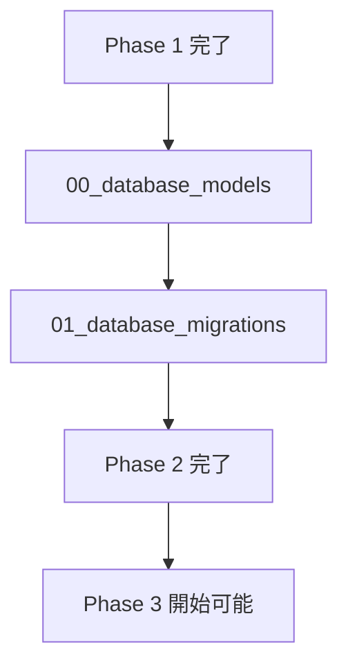

# Phase 2: データ基盤構築

## 目的

データモデルと永続化層を確立し、全サービスが使用する統一されたデータアクセス基盤を構築する。このフェーズは Phase 3 の全サービス開発の前提条件となる。

## ゴール

- 論文・著者・関係性を表現するデータモデルの完成
- データベースマイグレーション管理システムの構築
- 高性能なデータアクセス層の実装
- データベース設計の妥当性検証
- データ整合性とパフォーマンスの確保

## フェーズ構成

### 順次実行タスク
1. **00_database_models.md** - SQLAlchemyモデル・Pydanticスキーマ定義
2. **01_database_migrations.md** - Alembicマイグレーション設定

## 実行順序



## 実施者

- **推奨**: 1名のデータベースエキスパート
- **実施場所**: メインリポジトリ（Phase 1の shared パッケージを拡張）
- **ブランチ**: `claude/phase2-$(date +'%Y%m%d%H%M%S')`

## 完了条件

### 必須条件
- [ ] 全データベースモデルが定義されている
- [ ] Pydanticスキーマが完備されている
- [ ] Alembicマイグレーションが設定されている
- [ ] データベース接続管理クラスが実装されている
- [ ] インデックスとパフォーマンス最適化が完了
- [ ] `moon run shared:check` が正常終了

### データ設計条件
- [ ] ER図がドキュメント化されている
- [ ] 外部キー制約が適切に設定されている
- [ ] 一意制約が適切に設定されている
- [ ] インデックスが適切に配置されている
- [ ] データ型が適切に選択されている

### パフォーマンス条件
- [ ] 基本的なCRUD操作が効率的
- [ ] 複雑なクエリ（関係性検索）が最適化されている
- [ ] データベース初期化が高速
- [ ] マイグレーションが安全に実行できる

### テスト条件
- [ ] モデルの単体テストが作成されている
- [ ] マイグレーションテストが作成されている
- [ ] データ整合性テストが作成されている
- [ ] テストカバレッジが80%以上

## 見積もり時間

| タスク | 設計時間 | 実装時間 | テスト時間 | 計 |
|--------|----------|----------|-----------|-----|
| 00_database_models | 1時間 | 2時間 | 1時間 | 4時間 |
| 01_database_migrations | 30分 | 1時間 | 30分 | 2時間 |
| **合計** | **1.5時間** | **3時間** | **1.5時間** | **6時間** |

## 必要なスキル・知識

- SQLAlchemy 2.0+ の詳細な知識
- PostgreSQL の詳細な知識
- Alembic マイグレーション管理
- Pydantic モデル設計
- データベース設計原則
- インデックス設計とパフォーマンス最適化

## 前提条件

- Phase 1 が完了している
- PostgreSQL 16+ がインストール済み
- 共通ライブラリ（shared）が利用可能
- 環境設定管理システムが動作

## 重要な設計決定

### データモデル設計原則
- **正規化**: 第3正規形を基本とし、性能要件に応じて非正規化
- **外部キー**: すべての関係に外部キー制約を設定
- **インデックス**: 検索頻度の高いフィールドに適切なインデックス
- **命名規則**: snake_case、複数形テーブル名

### パフォーマンス最適化
- **インデックス戦略**: 複合インデックスの効果的な活用
- **クエリ最適化**: N+1問題の回避、適切なJOIN戦略
- **コネクションプール**: 適切なコネクション管理

### データ整合性
- **制約**: CHECK制約による値の妥当性保証
- **トランザクション**: ACID特性の適切な活用
- **カスケード**: 適切な削除戦略

## 注意事項

### 回避すべき問題
- 循環参照の発生
- 過度な非正規化
- インデックスの不足または過剰
- マイグレーションの安全性問題

### セキュリティ考慮事項
- SQLインジェクション対策（パラメータ化クエリ）
- 機密データの適切な取り扱い
- データベースユーザー権限の最小化

## 次フェーズへの引き継ぎ

### Phase 3 への前提条件
- 全データモデルが利用可能
- データベース接続が確立済み
- マイグレーションが適用済み
- 基本的なCRUD操作が確認済み

### 引き継ぎファイル
- `package/shared/src/refnet_shared/models/` - データモデル
- `package/shared/alembic/` - マイグレーションファイル
- `package/shared/src/refnet_shared/models/database_manager.py` - DB管理
- データベーススキーマドキュメント

## レビュー観点

### 技術的正確性と実装可能性
- [ ] データベースモデルの全体設計が一貫している
- [ ] SQLAlchemyとPostgreSQLのベストプラクティスに従っている
- [ ] データベーススキーマがドキュメントと一致している
- [ ] マイグレーションシステムが適切に動作する
- [ ] テストケースが十分に網羅されている

### 統合考慮事項
- [ ] Phase 1で構築した共通ライブラリと適切に統合されている
- [ ] Phase 3で開発する全サービスが利用可能なインターフェースになっている
- [ ] 各サービスでの利用パターンを考慮した設計になっている
- [ ] データアクセスパターンが統一されている

### 品質基準
- [ ] コーディング規約に準拠している
- [ ] ドキュメントが充実している
- [ ] ER図が最新の実装と一致している
- [ ] APIスキーマが適切に定義されている

### セキュリティとパフォーマンス考慮事項
- [ ] データベースセキュリティが適切に設定されている
- [ ] インデックス設計がパフォーマンス要件を満たしている
- [ ] スケーラビリティを考慮した設計になっている
- [ ] データ整合性制約が適切に設定されている
- [ ] トランザクション範囲が適切に設定されている

### 保守性とドキュメント
- [ ] データベーススキーマの発展性が考慮されている
- [ ] マイグレーション戦略が明確である
- [ ] テストデータの作成と管理が適切である
- [ ] デバッグとトラブルシューティングが容易である
- [ ] バックアップとリカバリ手順が整備されている

## バックアップ・リカバリ戦略

### 日次バックアップ手順
```bash
# 論理バックアップ（pg_dump）
pg_dump -h localhost -U refnet_user -d refnet_db \
  --clean --create --if-exists \
  --format=custom \
  --compress=9 \
  --file=backup_$(date +%Y%m%d_%H%M%S).dump

# 物理バックアップ（pg_basebackup） - 本番環境
pg_basebackup -h localhost -U postgres \
  --pgdata=backup_base_$(date +%Y%m%d) \
  --format=tar --compress=9 --checkpoint=fast
```

### リストア手順
```bash
# 開発環境での論理リストア
dropdb refnet_db
createdb refnet_db
pg_restore -h localhost -U refnet_user -d refnet_db backup_file.dump

# 本番環境での物理リストア（災害時）
systemctl stop postgresql
rm -rf /var/lib/postgresql/16/main/*
tar -xzf backup_base_YYYYMMDD.tar.gz -C /var/lib/postgresql/16/main/
systemctl start postgresql
```

### バックアップ保持ポリシー
- **日次バックアップ**: 30日間保持
- **週次バックアップ**: 12週間保持
- **月次バックアップ**: 12ヶ月保持
- **年次バックアップ**: 永続保持

### データベース設計固有の観点
- [ ] 論文研究ドメインの特性が適切にモデリングされている
- [ ] 引用・被引用関係のモデリングが適切である
- [ ] 大量データ処理を考慮した設計になっている
- [ ] 非同期処理を考慮したキューシステムが適切である
- [ ] 外部システムとの連携を考慮した設計になっている
- [ ] データのバージョニングと履歴管理が適切である

## データバージョニング戦略

### バージョン管理対象
- **論文メタデータ**: title, abstract, publication_date等の変更追跡
- **著者情報**: name, affiliation等の変更追跡
- **引用関係**: 新規発見または訂正時の履歴管理

### 実装アプローチ

**1. イベントソーシング方式**
```sql
-- 変更履歴テーブル
CREATE TABLE paper_history (
  id SERIAL PRIMARY KEY,
  paper_id UUID NOT NULL,
  change_type VARCHAR(20) NOT NULL, -- 'create', 'update', 'delete'
  changed_fields JSONB,            -- 変更されたフィールド
  old_values JSONB,                -- 変更前の値
  new_values JSONB,                -- 変更後の値
  changed_at TIMESTAMP DEFAULT NOW(),
  changed_by VARCHAR(100),         -- 変更者（システム/ユーザー）
  source_api VARCHAR(50),          -- データソース（semantic_scholar, arxiv等）
  FOREIGN KEY (paper_id) REFERENCES papers(id)
);
```

**2. タイムスタンプ方式**
```sql
-- 全テーブル共通のタイムスタンプカラム
ALTER TABLE papers ADD COLUMN
  created_at TIMESTAMP DEFAULT NOW(),
  updated_at TIMESTAMP DEFAULT NOW(),
  version INTEGER DEFAULT 1;

-- 更新トリガー
CREATE OR REPLACE FUNCTION update_timestamp()
RETURNS TRIGGER AS $$
BEGIN
  NEW.updated_at = NOW();
  NEW.version = OLD.version + 1;
  RETURN NEW;
END;
$$ LANGUAGE plpgsql;
```

### データ一貫性保証
- **論理削除**: 物理削除の代わりに`deleted_at`カラムで管理
- **参照整合性**: 履歴データでも外部キー制約を維持
- **データクリーンアップ**: 古い履歴データの自動アーカイブ（1年後）

## データモデル概要

### 主要エンティティ
- **Paper**: 論文の基本情報
- **Author**: 著者情報
- **PaperRelation**: 論文間の関係（引用・被引用）
- **Venue**: 会議・学会情報
- **Journal**: ジャーナル情報
- **ProcessingQueue**: 処理キュー管理

### 主要関係
- Paper ↔ Author（多対多）
- Paper → Venue（多対一）
- Paper → Journal（多対一）
- Paper ↔ Paper（多対多、関係テーブル経由）

## トラブルシューティング

### よくある問題

1. **マイグレーションが失敗する**
   - 解決策: 外部キー制約の順序、データ型の互換性を確認

2. **クエリが遅い**
   - 解決策: 実行計画を確認、適切なインデックスを追加

3. **テストでデータベース接続エラー**
   - 解決策: テスト用データベースの設定、権限を確認

4. **モデル間の循環参照**
   - 解決策: lazy loading、forward referenceの適切な使用

### ヘルプリソース

- [SQLAlchemy 2.0 Documentation](https://docs.sqlalchemy.org/en/20/)
- [Alembic Documentation](https://alembic.sqlalchemy.org/)
- [PostgreSQL Documentation](https://www.postgresql.org/docs/)
- プロジェクトの `docs/database/` ディレクトリ
