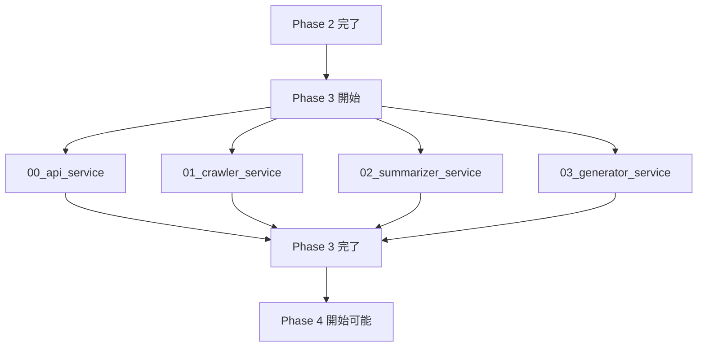

# Phase 3: コアサービス開発

## 目的

論文収集・要約・関係性分析の各サービスを並列で開発し、RefNetシステムの中核機能を実装する。各サービスは独立したマイクロサービスとして設計し、Phase 2で構築したデータ基盤を活用する。

## ゴール

- 4つのコアサービスの完成
- 各サービス間の連携機能の実装
- 非同期処理による高性能化
- 堅牢なエラーハンドリングの実装
- 包括的なテストカバレッジの確保

## フェーズ構成

### 並列実行タスク（全てのタスクが同時並列実行可能）

1. **00_api_service.md** - FastAPI REST API サーバー
2. **01_crawler_service.md** - 論文収集・メタデータ取得サービス
3. **02_summarizer_service.md** - AI要約生成サービス
4. **03_generator_service.md** - Obsidianファイル生成サービス

## 実行順序

## 実施者

- **推奨**: 2-4名のエンジニア（サービス毎に1名）
- **実施場所**: 各サービス独立のgit worktreeブランチ
- **ブランチ戦略**:
  - `claude/phase3-api-$(date +'%Y%m%d%H%M%S')`
  - `claude/phase3-crawler-$(date +'%Y%m%d%H%M%S')`
  - `claude/phase3-summarizer-$(date +'%Y%m%d%H%M%S')`
  - `claude/phase3-generator-$(date +'%Y%m%d%H%M%S')`

## 完了条件

### 必須条件
- [ ] 全4サービスが実装されている
- [ ] 各サービスのREST API・CLI・Celeryタスクが動作
- [ ] サービス間連携が動作している
- [ ] 非同期処理が適切に実装されている
- [ ] 全サービスで `moon run <service>:check` が正常終了

### 機能条件
- [ ] APIサーバーが論文検索・取得・管理機能を提供
- [ ] クローラーがSemantic Scholar APIから論文データを取得
- [ ] 要約サービスがAI APIを使用して論文要約を生成
- [ ] 生成サービスがObsidianファイル・グラフを出力

### 性能条件
- [ ] API応答時間が平均500ms以下
- [ ] クローラーがレート制限内で効率的に動作
- [ ] 要約生成がバッチ処理で効率的に動作
- [ ] 大規模論文ネットワークの生成が可能

### テスト条件
- [ ] 各サービスの単体テストが作成されている
- [ ] 統合テストが作成されている
- [ ] E2Eテストが作成されている
- [ ] 全サービスのテストカバレッジが80%以上

## 見積もり時間

| タスク | 設計時間 | 実装時間 | テスト時間 | 計 |
|--------|----------|----------|-----------|-----|
| 00_api_service | 2時間 | 4時間 | 2時間 | 8時間 |
| 01_crawler_service | 1.5時間 | 3時間 | 1.5時間 | 6時間 |
| 02_summarizer_service | 1.5時間 | 3時間 | 1.5時間 | 6時間 |
| 03_generator_service | 2時間 | 4時間 | 2時間 | 8時間 |
| **合計** | **7時間** | **14時間** | **7時間** | **28時間** |

**並列実行時**: 最大8時間（最も時間のかかるタスク）

## 必要なスキル・知識

- FastAPI・Pydantic・SQLAlchemy の詳細な知識
- Celery・Redis での非同期処理
- 外部API統合（Semantic Scholar、OpenAI、Anthropic）
- REST API設計原則
- マイクロサービス設計パターン
- テスト駆動開発（TDD）

## 前提条件

- Phase 2 が完了している
- データベースモデルが利用可能
- 共通ライブラリ（shared）が利用可能
- 環境設定管理システムが動作

## 重要な設計決定

### サービス間通信
- **REST API**: 同期的なサービス間通信
- **Celery**: 非同期バックグラウンドタスク
- **Redis**: タスクキュー・セッション管理・キャッシュ

### データアクセス
- **SQLAlchemy**: 統一されたORM使用
- **Connection Pool**: 効率的なDB接続管理
- **Transaction Management**: 適切なトランザクション境界

### エラーハンドリング
- **Structured Logging**: 統一されたログ形式
- **Exception Handling**: 適切な例外処理・再試行
- **Circuit Breaker**: 外部API障害時の対応

### セキュリティ
- **API Authentication**: JWT認証
- **Input Validation**: Pydanticによる厳密な検証
- **Rate Limiting**: API使用量制限

## 注意事項

### 回避すべき問題
- サービス間の密結合
- 外部API制限の考慮不足
- メモリリークの発生
- 同期処理によるパフォーマンス低下

### 並列開発での考慮事項
- 共通ライブラリの変更は慎重に
- APIスキーマの変更は事前調整
- データベーススキーマの変更は避ける
- 統合テストは最終段階で実施

## 次フェーズへの引き継ぎ

### Phase 4 への前提条件
- 全サービスが動作確認済み
- サービス間連携が動作確認済み
- 基本的なE2Eテストが完了
- パフォーマンス要件が満たされている

### 引き継ぎファイル
- `package/api/` - API サーバー
- `package/crawler/` - クローラーサービス
- `package/summarizer/` - 要約サービス
- `package/generator/` - 生成サービス
- 各サービスの設定・テスト・ドキュメント

## サービス概要

### API Service
- **役割**: REST API・GraphQL提供、認証、リクエスト処理
- **技術**: FastAPI、Pydantic、SQLAlchemy
- **主要機能**: 論文検索、データ取得、処理状況管理

### Crawler Service
- **役割**: 論文メタデータ・PDF取得、関係性データ収集
- **技術**: aiohttp、BeautifulSoup、Selenium
- **主要機能**: Semantic Scholar API連携、PDF取得、並列処理

### Summarizer Service
- **役割**: AI要約生成、要約品質評価
- **技術**: OpenAI API、Anthropic API、langchain
- **主要機能**: 論文要約、品質評価、バッチ処理

### Generator Service
- **役割**: Obsidianファイル・グラフ生成、可視化
- **技術**: Jinja2、NetworkX、Matplotlib
- **主要機能**: Markdownファイル生成、関係性グラフ、統計情報

## レビュー観点

### 技術的正確性と実装の妥当性
- [ ] 4つのコアサービスが適切に設計・実装されている
- [ ] マイクロサービスアーキテクチャが適切である
- [ ] 非同期処理が各サービスで適切に実装されている
- [ ] 共通ライブラリ（shared）の使用が一貫している
- [ ] データベースアクセスパターンが統一されている

### 統合性と連携
- [ ] サービス間通信が適切に設計されている（REST API、Celery）
- [ ] データ整合性が確保されている
- [ ] APIスキーマの一貫性が維持されている
- [ ] サービス間の依存関係が適切に管理されている
- [ ] 環境設定管理が統一されている

### 品質標準
- [ ] 全サービスでエラーハンドリングが一貫している
- [ ] ログ出力が統一され運用可能である（structlog）
- [ ] 全サービスでテストカバレッジが80%以上である
- [ ] 型ヒントが一貫して使用されている
- [ ] コーディング規約への準拠が確保されている
- [ ] ドキュメントの品質と網羅性が適切である

### セキュリティとパフォーマンス
- [ ] 入力検証とサニタイゼーションが全サービスで適切である
- [ ] APIキー等の機密情報管理が適切である
- [ ] レート制限やリソース制限への対応が適切である
- [ ] パフォーマンス要件（API応答500ms以下）を満たす設計である
- [ ] メモリ使用量やリソース管理が適切である
- [ ] 大規模データ処理へのスケーラビリティが考慮されている

### 保守性とドキュメント
- [ ] サービス構成が保守しやすい構造になっている
- [ ] デプロイメント設定（Docker、moon.yml）が適切である
- [ ] 依存関係管理が一貫している
- [ ] モニタリングとログ集約が考慮されている
- [ ] サービス間のバージョン互換性が考慮されている

### Phase 3固有の観点
- [ ] 並列開発の制約事項が適切に管理されている
- [ ] 各サービスの独立性と結合度のバランスが適切である
- [ ] 統合テストとE2Eテストの戦略が適切である
- [ ] サービス間のデータフローが正しく設計されている
- [ ] 失敗時のロールバック戦略が考慮されている
- [ ] Phase 4への移行準備が適切である

## トラブルシューティング

### よくある問題

1. **サービス間通信エラー**
   - 解決策: ネットワーク設定、APIスキーマ、認証設定を確認

2. **外部API制限エラー**
   - 解決策: レート制限、リトライ戦略、API キー設定を確認

3. **非同期処理の問題**
   - 解決策: Celeryワーカー、Redis接続、タスクキューを確認

4. **メモリ使用量過多**
   - 解決策: バッチサイズ、接続プール、キャッシュ設定を調整

### ヘルプリソース

- [FastAPI Documentation](https://fastapi.tiangolo.com/)
- [Celery Documentation](https://docs.celeryq.dev/)
- [Semantic Scholar API Documentation](https://api.semanticscholar.org/)
- プロジェクトの `docs/services/` ディレクトリ
