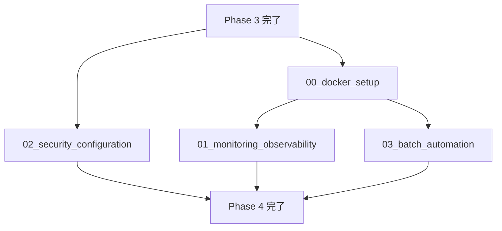

# Phase 4: インフラ・運用

## 目的

RefNetシステムの本番運用に必要なインフラストラクチャ、監視、セキュリティ、自動化機能を実装する。Phase 3で開発されたサービスを安定稼働させるための運用基盤を構築する。

## ゴール

- コンテナ化されたマイクロサービス基盤の構築
- 包括的な監視・ログ・メトリクス収集システム
- セキュリティ強化とアクセス制御
- 自動化されたバッチ処理・スケジューリング
- 本番環境での安定稼働の実現

## フェーズ構成

### 部分並列実行タスク

1. **00_docker_setup.md** - Docker Compose・コンテナオーケストレーション
2. **01_monitoring_observability.md** - 監視・ログ・メトリクス（Docker完了後）
3. **02_security_configuration.md** - セキュリティ・認証・認可（独立実行可能）
4. **03_batch_automation.md** - バッチスケジューリング・自動化（Phase 3完了後）

## 実行順序

## 実施者

- **推奨**: 1-2名のDevOps/インフラエンジニア
- **実施場所**: メインリポジトリ（インフラ設定の追加）
- **ブランチ戦略**:
  - `claude/phase4-infrastructure-$(date +'%Y%m%d%H%M%S')`
  - または個別タスクごとの細分化ブランチ

## 完了条件

### 必須条件
- [ ] 全サービスがDocker Composeで起動
- [ ] 監視・ログ・メトリクス収集が動作
- [ ] セキュリティ設定が適用
- [ ] バッチ処理の自動化が動作
- [ ] 本番環境デプロイが可能

### インフラ条件
- [ ] Docker Composeでローカル開発環境構築
- [ ] Prometheusメトリクス収集
- [ ] Grafana可視化ダッシュボード
- [ ] 構造化ログ収集（ELKまたは類似）
- [ ] ヘルスチェック・アラート

### セキュリティ条件
- [ ] JWT認証・認可システム
- [ ] HTTPS/TLS設定
- [ ] APIレート制限
- [ ] セキュリティヘッダー設定
- [ ] 機密情報の適切な管理

### 自動化条件
- [ ] 定期的な論文収集バッチ
- [ ] 自動要約生成スケジューリング
- [ ] データバックアップ自動化
- [ ] システムヘルスチェック自動化

## 見積もり時間

| タスク | 設計時間 | 実装時間 | テスト時間 | 計 |
|--------|----------|----------|-----------|-----|
| 00_docker_setup | 1時間 | 3時間 | 1時間 | 5時間 |
| 01_monitoring_observability | 1.5時間 | 4時間 | 1.5時間 | 7時間 |
| 02_security_configuration | 1時間 | 2時間 | 1時間 | 4時間 |
| 03_batch_automation | 1時間 | 2時間 | 1時間 | 4時間 |
| **合計** | **4.5時間** | **11時間** | **4.5時間** | **20時間** |

**部分並列実行時**: 最大7時間（最も時間のかかるタスク）

## 必要なスキル・知識

- Docker・Docker Compose の詳細な知識
- Prometheus・Grafana での監視システム構築
- ELK Stack または類似ログ収集システム
- JWT認証・セキュリティベストプラクティス
- Nginx・リバースプロキシ設定
- Celery Beat・定期タスク管理
- Linux系OS・クラウドインフラ基礎

## 前提条件

- Phase 3 が完了している
- 全サービスが個別に動作確認済み
- データベースマイグレーションが完了
- 基本的なE2Eテストが完了

## 重要な設計決定

### インフラアーキテクチャ
- **コンテナ化**: 全サービスをDockerコンテナ化
- **オーケストレーション**: Docker Composeによる開発環境管理
- **プロキシ**: Nginxによるリバースプロキシ・ロードバランシング
- **データ永続化**: Docker Volume による永続化

### 監視戦略
- **メトリクス**: Prometheus + Grafana
- **ログ**: 構造化ログ + 集約（ELK Stack推奨）
- **アラート**: Prometheusアラートルール
- **ヘルスチェック**: 各サービスの/healthエンドポイント

### セキュリティ設計
- **認証**: JWT ベース認証システム
- **認可**: RBAC（Role-Based Access Control）
- **通信**: HTTPS/TLS 必須
- **API保護**: レート制限・DDoS対策

### 自動化戦略
- **スケジューリング**: Celery Beat による定期タスク
- **バックアップ**: 自動データベースバックアップ
- **デプロイ**: CI/CD パイプライン対応準備
- **監視**: 自動障害検知・通知

## 注意事項

### 回避すべき問題
- 単一障害点の作成
- 機密情報のハードコーディング
- 過度に複雑な設定
- パフォーマンスボトルネック

### 運用での考慮事項
- ログローテーション設定
- メトリクス保持期間設定
- バックアップリテンション
- セキュリティアップデート対応

## 次フェーズへの引き継ぎ

### 本番デプロイへの前提条件
- 全インフラが動作確認済み
- 監視システムが正常稼働
- セキュリティ設定が適用済み
- 自動化システムが正常稼働

### 引き継ぎファイル
- `docker-compose.yml` - 全サービス定義
- `docker/` - Dockerfileと設定ファイル
- `monitoring/` - 監視設定
- `security/` - セキュリティ設定
- `scripts/` - 自動化スクリプト

## インフラ概要

### Docker構成
- **API Gateway**: Nginx リバースプロキシ
- **API Service**: FastAPI アプリケーション
- **Worker Services**: Celery ワーカー（Crawler, Summarizer, Generator）
- **Database**: PostgreSQL + Redis
- **Monitoring**: Prometheus, Grafana, ELK Stack

### 監視対象
- **システムメトリクス**: CPU、メモリ、ディスク、ネットワーク
- **アプリケーションメトリクス**: API応答時間、エラー率、スループット
- **ビジネスメトリクス**: 論文収集数、要約生成数、処理時間
- **ログ**: 構造化ログ、エラーログ、監査ログ

### セキュリティ要素
- **認証**: JWT + リフレッシュトークン
- **認可**: API エンドポイント別アクセス制御
- **通信**: TLS/HTTPS 必須
- **データ保護**: 暗号化・ハッシュ化

### 自動化機能
- **データ収集**: 定期的な論文クローリング
- **要約生成**: バッチでの自動要約生成
- **データメンテナンス**: 古いデータのクリーンアップ
- **システム監視**: 自動障害検知・復旧

## レビュー観点

### インフラ全体設計
- [ ] マイクロサービスアーキテクチャが適切に実装されている
- [ ] サービス間の通信が安全かつ効率的である
- [ ] スケーラビリティが考慮された設計になっている
- [ ] 単一障害点が排除されている

### 運用準備状況
- [ ] 監視・アラートシステムが包括的である
- [ ] ログが適切に収集・分析可能である
- [ ] バックアップ・リストア手順が確立されている
- [ ] 障害対応手順が文書化されている

### セキュリティ
- [ ] 認証・認可システムが堅牢である
- [ ] 通信が暗号化されている
- [ ] 機密情報が適切に管理されている
- [ ] セキュリティ監査ログが取得されている

### パフォーマンス
- [ ] 各サービスのリソース使用量が最適化されている
- [ ] ボトルネックが特定・解消されている
- [ ] キャッシュ戦略が効果的である
- [ ] 負荷テストが実施されている

### 自動化
- [ ] 定期的なタスクが適切に自動化されている
- [ ] デプロイプロセスが自動化可能である
- [ ] 監視・アラートが自動化されている
- [ ] メンテナンスタスクが自動化されている

### ドキュメント
- [ ] インフラ構成図が最新である
- [ ] 運用手順書が整備されている
- [ ] トラブルシューティングガイドが充実している
- [ ] 変更履歴が記録されている

## トラブルシューティング

### よくある問題

1. **Docker コンテナ起動失敗**
   - 解決策: ポート競合、メモリ不足、依存関係を確認

2. **監視メトリクス収集失敗**
   - 解決策: Prometheusターゲット設定、エンドポイント疎通を確認

3. **認証システム問題**
   - 解決策: JWT署名キー、トークン有効期限を確認

4. **バッチ処理実行失敗**
   - 解決策: Celery Beat設定、タスクキュー状況を確認

### ヘルプリソース

- [Docker Documentation](https://docs.docker.com/)
- [Prometheus Documentation](https://prometheus.io/docs/)
- [Grafana Documentation](https://grafana.com/docs/)
- [Nginx Documentation](https://nginx.org/en/docs/)
- プロジェクトの `docs/infrastructure/` ディレクトリ
