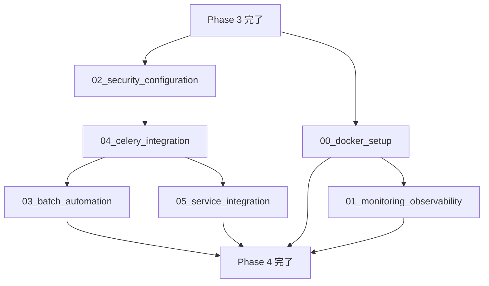

# Phase 4: インフラ・運用

## 目的

RefNetシステムの本番運用に必要なインフラストラクチャ、監視、セキュリティ、自動化機能を実装する。Phase 3で開発されたサービスを安定稼働させるための運用基盤を構築する。

## ゴール

- コンテナ化されたマイクロサービス基盤の構築
- 包括的な監視・ログ・メトリクス収集システム
- セキュリティ強化とアクセス制御
- 自動化されたバッチ処理・スケジューリング
- 本番環境での安定稼働の実現

## フェーズ構成

### 部分並列実行タスク

1. **00_docker_setup.md** - Docker Compose・コンテナオーケストレーション
2. **01_monitoring_observability.md** - 監視・ログ・メトリクス（Docker完了後）
3. **02_security_configuration.md** - セキュリティ・認証・認可（独立実行可能）
4. **03_batch_automation.md** - バッチスケジューリング・自動化（Phase 3完了後）
5. **04_celery_integration.md** - Celery統合設定（Beat・Flower・統一アプリケーション）
6. **05_service_integration.md** - サービス間連携設定（エンドツーエンド処理フロー）

## 実行順序



### 推奨実行順序（最新）

1. **02_security_configuration.md**（最優先）
   - APIエンドポイントの認証基盤
   - 他のサービスがAPIを呼び出す際の前提条件

2. **04_celery_integration.md**
   - 統一Celeryアプリケーション構築
   - Beat・Flowerの統合設定

3. **03_batch_automation.md**
   - 統一Celeryアプリ上での定期タスク実装
   - 具体的なスケジュール設定

4. **05_service_integration.md**（最終）
   - 全サービスの統合とエンドツーエンド処理
   - 認証・Celery・バッチ処理が必要

## 実施者

- **推奨**: 1-2名のDevOps/インフラエンジニア
- **実施場所**: メインリポジトリ（インフラ設定の追加）
- **ブランチ戦略**:
  - `claude/phase4-infrastructure-$(date +'%Y%m%d%H%M%S')`
  - または個別タスクごとの細分化ブランチ

## タスク実行手順

### 1. 事前準備
```bash
# 新しいブランチの作成
git checkout -b claude/phase4-$(date +'%Y%m%d%H%M%S')

# 環境変数の設定
cp .env.example .env
# .envファイルを編集してAPIキーを設定
```

### 2. 実行フロー

#### Phase 1: セキュリティ設定
```bash
# 02_security_configuration.mdを実行
# - JWT認証システムの実装
# - APIセキュリティ設定
# - レート制限の設定
```

#### Phase 2: Celery統合
```bash
# 04_celery_integration.mdを実行
# - 統一Celeryアプリケーションの実装
# - Beat・Flowerの設定
# - タスクルーティングの設定
```

#### Phase 3: バッチ自動化
```bash
# 03_batch_automation.mdを実行
# - 定期実行タスクの実装
# - スケジュール設定
# - バックアップ自動化
```

#### Phase 4: サービス統合
```bash
# 05_service_integration.mdを実行
# - エンドツーエンド処理フローの実装
# - サービス間連携の設定
# - 統合テストの実行
```

### 3. 動作確認
```bash
# システム全体の起動
scripts/docker-dev.sh up

# 各サービスの確認
curl http://localhost:8000/health
curl http://localhost:5555  # Flower
curl http://localhost:8000/api/papers/search?q=test

# 完全フローのテスト
curl -X POST http://localhost:8000/api/papers/crawl \
  -H "Content-Type: application/json" \
  -d '{"paper_url": "https://example.com/paper"}'
```

### 4. レビュー・品質確認
```bash
# コード品質チェック
moon :check

# パフォーマンステスト
locust -f tests/load_test.py --host=http://localhost:8000
```

## 完了条件

### 必須条件
- [ ] 全サービスがDocker Composeで起動
- [ ] 監視・ログ・メトリクス収集が動作
- [ ] セキュリティ設定が適用
- [ ] バッチ処理の自動化が動作
- [ ] 本番環境デプロイが可能

### インフラ条件
- [ ] Docker Composeでローカル開発環境構築
- [ ] Prometheusメトリクス収集
- [ ] Grafana可視化ダッシュボード
- [ ] 構造化ログ収集（ELKまたは類似）
- [ ] ヘルスチェック・アラート

### セキュリティ条件
- [ ] JWT認証・認可システム
- [ ] HTTPS/TLS設定
- [ ] APIレート制限
- [ ] セキュリティヘッダー設定
- [ ] 機密情報の適切な管理

### 自動化条件
- [ ] 定期的な論文収集バッチ
- [ ] 自動要約生成スケジューリング
- [ ] データバックアップ自動化
- [ ] システムヘルスチェック自動化

### Celery統合条件
- [ ] 統一Celeryアプリケーションが全サービスで使用されている
- [ ] Celery Beat・Flowerが正常に動作している
- [ ] タスクルーティングが適切に設定されている
- [ ] 定期実行タスクが正しい間隔で実行されている

### サービス間連携条件
- [ ] APIエンドポイントから論文クロールをトリガーできる
- [ ] 各サービスが正しい順序でタスクを連携している
- [ ] エラー時のリトライ機構が動作している
- [ ] エンドツーエンドの処理フローが完全に動作している


## 必要なスキル・知識

- Docker・Docker Compose の詳細な知識
- Prometheus・Grafana での監視システム構築
- ELK Stack または類似ログ収集システム
- JWT認証・セキュリティベストプラクティス
- Nginx・リバースプロキシ設定
- Celery Beat・定期タスク管理
- Linux系OS・クラウドインフラ基礎

## 前提条件

- Phase 3 が完了している
- 全サービスが個別に動作確認済み
- データベースマイグレーションが完了
- 基本的なE2Eテストが完了

## 重要な設計決定

### インフラアーキテクチャ
- **コンテナ化**: 全サービスをDockerコンテナ化
- **オーケストレーション**: Docker Composeによる開発環境管理
- **プロキシ**: Nginxによるリバースプロキシ・ロードバランシング
- **データ永続化**: Docker Volume による永続化

### 監視戦略
- **メトリクス**: Prometheus + Grafana
- **ログ**: 構造化ログ + 集約（ELK Stack推奨）
- **アラート**: Prometheusアラートルール
- **ヘルスチェック**: 各サービスの/healthエンドポイント

### セキュリティ設計
- **認証**: JWT ベース認証システム
- **認可**: RBAC（Role-Based Access Control）
- **通信**: HTTPS/TLS 必須
- **API保護**: レート制限・DDoS対策

### 自動化戦略
- **スケジューリング**: Celery Beat による定期タスク
- **バックアップ**: 自動データベースバックアップ
- **デプロイ**: CI/CD パイプライン対応準備
- **監視**: 自動障害検知・通知

## 注意事項

### 回避すべき問題
- 単一障害点の作成
- 機密情報のハードコーディング
- 過度に複雑な設定
- パフォーマンスボトルネック

### 運用での考慮事項
- ログローテーション設定
- メトリクス保持期間設定
- バックアップリテンション
- セキュリティアップデート対応

## 次フェーズへの引き継ぎ

### 本番デプロイへの前提条件
- 全インフラが動作確認済み
- 監視システムが正常稼働
- セキュリティ設定が適用済み
- 自動化システムが正常稼働

### 引き継ぎファイル
- `docker-compose.yml` - 全サービス定義
- `docker/` - Dockerfileと設定ファイル
- `monitoring/` - 監視設定
- `security/` - セキュリティ設定
- `scripts/` - 自動化スクリプト

## インフラ概要

### Docker構成
- **API Gateway**: Nginx リバースプロキシ
- **API Service**: FastAPI アプリケーション
- **Worker Services**: Celery ワーカー（Crawler, Summarizer, Generator）
- **Database**: PostgreSQL + Redis
- **Monitoring**: Prometheus, Grafana, ELK Stack

### 監視対象
- **システムメトリクス**: CPU、メモリ、ディスク、ネットワーク
- **アプリケーションメトリクス**: API応答時間、エラー率、スループット
- **ビジネスメトリクス**: 論文収集数、要約生成数、処理時間
- **ログ**: 構造化ログ、エラーログ、監査ログ

### セキュリティ要素
- **認証**: JWT + リフレッシュトークン
- **認可**: API エンドポイント別アクセス制御
- **通信**: TLS/HTTPS 必須
- **データ保護**: 暗号化・ハッシュ化

### 自動化機能
- **データ収集**: 定期的な論文クローリング
- **要約生成**: バッチでの自動要約生成
- **データメンテナンス**: 古いデータのクリーンアップ
- **システム監視**: 自動障害検知・復旧

## レビュー観点

### インフラ全体設計
- [ ] マイクロサービスアーキテクチャが適切に実装されている
- [ ] サービス間の通信が安全かつ効率的である
- [ ] スケーラビリティが考慮された設計になっている
- [ ] 単一障害点が排除されている

### Celery統合設定のレビュー観点
- [ ] **技術的正確性**: Celery設定の整合性、タスクルーティング、スケジュール設定
- [ ] **パフォーマンス**: ワーカー設定、タスク有効期限、実行時間制限
- [ ] **セキュリティ**: 認証情報、環境変数、ネットワーク分離
- [ ] **エラーハンドリング**: リトライ機構、エラーログ、監視機能
- [ ] **保守性**: ログ出力、設定の外部化、Docker設定
- [ ] **データ整合性**: トランザクション、重複処理防止、データ競合

### サービス間連携のレビュー観点
- [ ] **通信の正確性**: APIエンドポイント、タスク送信、非同期処理
- [ ] **データ整合性**: トランザクション、重複処理防止、外部キー制約
- [ ] **耐障害性**: リトライ機構、例外処理、タイムアウト処理
- [ ] **パフォーマンス**: 並列処理、メモリ使用量、クエリ最適化
- [ ] **セキュリティ**: 入力検証、SQLインジェクション防止、認証・認可
- [ ] **監視・可観測性**: 構造化ログ、メトリクス、分散トレーシング

### 運用準備状況
- [ ] 監視・アラートシステムが包括的である
- [ ] ログが適切に収集・分析可能である
- [ ] バックアップ・リストア手順が確立されている
- [ ] 障害対応手順が文書化されている

### セキュリティ
- [ ] 認証・認可システムが堅牢である
- [ ] 通信が暗号化されている
- [ ] 機密情報が適切に管理されている
- [ ] セキュリティ監査ログが取得されている

### パフォーマンス
- [ ] 各サービスのリソース使用量が最適化されている
- [ ] ボトルネックが特定・解消されている
- [ ] キャッシュ戦略が効果的である
- [ ] 負荷テストが実施されている

## パフォーマンス監視・ボトルネック対策

### リアルタイムパフォーマンス監視

**1. システムリソース監視**
```yaml
# Prometheus監視設定
- job_name: 'node-exporter'
  static_configs:
    - targets: ['localhost:9100']
  scrape_interval: 5s
  metrics_path: /metrics

# 重要メトリクス
system_metrics:
  - cpu_usage_percent        # CPU使用率
  - memory_usage_percent     # メモリ使用率
  - disk_io_utilization     # ディスクI/O
  - network_throughput      # ネットワーク転送量
```

**2. アプリケーション性能監視**
```python
# FastAPIメトリクス収集
from prometheus_client import Counter, Histogram, Gauge

REQUEST_COUNT = Counter('requests_total', 'Total requests', ['method', 'endpoint', 'status'])
REQUEST_LATENCY = Histogram('request_duration_seconds', 'Request latency')
ACTIVE_CONNECTIONS = Gauge('active_connections', 'Active database connections')

@app.middleware("http")
async def metrics_middleware(request: Request, call_next):
    start_time = time.time()
    response = await call_next(request)
    duration = time.time() - start_time

    REQUEST_LATENCY.observe(duration)
    REQUEST_COUNT.labels(method=request.method,
                        endpoint=request.url.path,
                        status=response.status_code).inc()
    return response
```

### ボトルネック特定手順

**1. 自動ボトルネック検出**
```python
# パフォーマンス異常検知
class PerformanceMonitor:
    def __init__(self):
        self.thresholds = {
            'api_response_time': 0.5,  # 500ms
            'cpu_usage': 80,           # 80%
            'memory_usage': 85,        # 85%
            'db_connection_pool': 0.8  # 80%
        }

    async def check_bottlenecks(self):
        issues = []

        # API応答時間チェック
        avg_response_time = await self.get_avg_response_time()
        if avg_response_time > self.thresholds['api_response_time']:
            issues.append(f"API response time: {avg_response_time:.2f}s")

        # リソース使用率チェック
        cpu_usage = await self.get_cpu_usage()
        if cpu_usage > self.thresholds['cpu_usage']:
            issues.append(f"High CPU usage: {cpu_usage}%")

        return issues
```

**2. 段階的ボトルネック解析**
```bash
# Step 1: 全体概要の確認
docker stats --no-stream
htop

# Step 2: データベース性能分析
psql -d refnet_db -c "
SELECT query, mean_time, calls, total_time
FROM pg_stat_statements
ORDER BY total_time DESC LIMIT 10;"

# Step 3: アプリケーション プロファイリング
python -m cProfile -o profile.stats api_service.py
python -c "
import pstats
p = pstats.Stats('profile.stats')
p.sort_stats('tottime').print_stats(20)
"

# Step 4: 詳細メトリクス分析
curl http://localhost:8000/metrics | grep -E "(response_time|error_rate|throughput)"
```

### 性能最適化戦略

**1. データベース最適化**
```sql
-- インデックス効果分析
EXPLAIN (ANALYZE, BUFFERS)
SELECT * FROM papers p
JOIN paper_relations pr ON p.id = pr.target_paper_id
WHERE p.title ILIKE '%machine learning%';

-- 接続プール最適化
-- sqlalchemy pool settings
pool_size=20
max_overflow=30
pool_timeout=30
pool_recycle=3600
```

**2. キャッシュ戦略最適化**
```python
# 階層化キャッシュ
@cache(expire=3600)  # 1時間キャッシュ
async def get_paper_summary(paper_id: str):
    # データベースアクセス
    pass

# Redis分散キャッシュ
import redis.asyncio as redis

redis_client = redis.Redis(host='redis', port=6379, db=0)

async def cached_api_call(api_endpoint: str, params: dict):
    cache_key = f"api:{api_endpoint}:{hash(str(params))}"
    cached = await redis_client.get(cache_key)

    if cached:
        return json.loads(cached)

    result = await external_api_call(api_endpoint, params)
    await redis_client.setex(cache_key, 1800, json.dumps(result))  # 30分
    return result
```

## 負荷テスト実施計画

### 負荷テストシナリオ

**1. 段階的負荷テスト**
```yaml
# locust負荷テスト設定
test_scenarios:
  - name: "normal_load"
    users: 10
    spawn_rate: 1
    duration: "10m"

  - name: "peak_load"
    users: 50
    spawn_rate: 5
    duration: "20m"

  - name: "stress_test"
    users: 100
    spawn_rate: 10
    duration: "30m"
```

**2. 負荷テストスクリプト**
```python
# locustfile.py
from locust import HttpUser, task, between

class RefNetUser(HttpUser):
    wait_time = between(1, 3)

    def on_start(self):
        # 認証
        response = self.client.post("/auth/login", json={
            "username": "test_user",
            "password": "test_password"
        })
        self.token = response.json()["access_token"]
        self.headers = {"Authorization": f"Bearer {self.token}"}

    @task(3)
    def search_papers(self):
        self.client.get("/api/papers/search",
                       params={"q": "machine learning", "limit": 10},
                       headers=self.headers)

    @task(2)
    def get_paper_details(self):
        self.client.get("/api/papers/123", headers=self.headers)

    @task(1)
    def create_summary_task(self):
        self.client.post("/api/tasks/summarize",
                        json={"paper_id": "123"},
                        headers=self.headers)
```

**3. 負荷テスト実行手順**
```bash
# 基本負荷テスト
locust -f locustfile.py --host=http://localhost:8000 \
       --users 10 --spawn-rate 1 --run-time 600s

# 分散負荷テスト
# Master node
locust -f locustfile.py --master --host=http://localhost:8000

# Worker nodes
locust -f locustfile.py --worker --master-host=192.168.1.100

# CI/CD自動負荷テスト
pytest tests/load_tests/ --junitxml=load_test_results.xml
```

**4. 性能基準・合格条件**
```yaml
performance_criteria:
  api_response_time:
    p95: "< 500ms"
    p99: "< 1000ms"

  throughput:
    min_rps: 100  # requests per second

  error_rate:
    max_error_rate: "< 1%"

  resource_usage:
    cpu: "< 80%"
    memory: "< 85%"

  database:
    connection_pool_usage: "< 80%"
    query_time_p95: "< 100ms"
```

### 自動化
- [ ] 定期的なタスクが適切に自動化されている
- [ ] デプロイプロセスが自動化可能である
- [ ] 監視・アラートが自動化されている
- [ ] メンテナンスタスクが自動化されている

### ドキュメント
- [ ] インフラ構成図が最新である
- [ ] 運用手順書が整備されている
- [ ] トラブルシューティングガイドが充実している
- [ ] 変更履歴が記録されている

## トラブルシューティング

### よくある問題

1. **Docker コンテナ起動失敗**
   - 解決策: ポート競合、メモリ不足、依存関係を確認

2. **監視メトリクス収集失敗**
   - 解決策: Prometheusターゲット設定、エンドポイント疎通を確認

3. **認証システム問題**
   - 解決策: JWT署名キー、トークン有効期限を確認

4. **バッチ処理実行失敗**
   - 解決策: Celery Beat設定、タスクキュー状況を確認

5. **Celery統合問題**
   - 解決策: 統一Celeryアプリケーションの設定、タスクルーティングを確認
   - 確認コマンド: `celery -A refnet_shared.celery_app inspect registered`

6. **サービス間連携失敗**
   - 解決策: タスク送信の引数、キューの設定、エラーハンドリングを確認
   - 確認コマンド: `docker-compose logs -f crawler summarizer generator`

7. **Flower認証失敗**
   - 解決策: 環境変数 `FLOWER_USER`、`FLOWER_PASSWORD` を確認

8. **タスクが実行されない**
   - 解決策: Celery Beat スケジュール、ワーカーの起動状況を確認
   - 確認コマンド: `celery -A refnet_shared.celery_app inspect active`

### ヘルプリソース

- [Docker Documentation](https://docs.docker.com/)
- [Prometheus Documentation](https://prometheus.io/docs/)
- [Grafana Documentation](https://grafana.com/docs/)
- [Nginx Documentation](https://nginx.org/en/docs/)
- プロジェクトの `docs/infrastructure/` ディレクトリ
